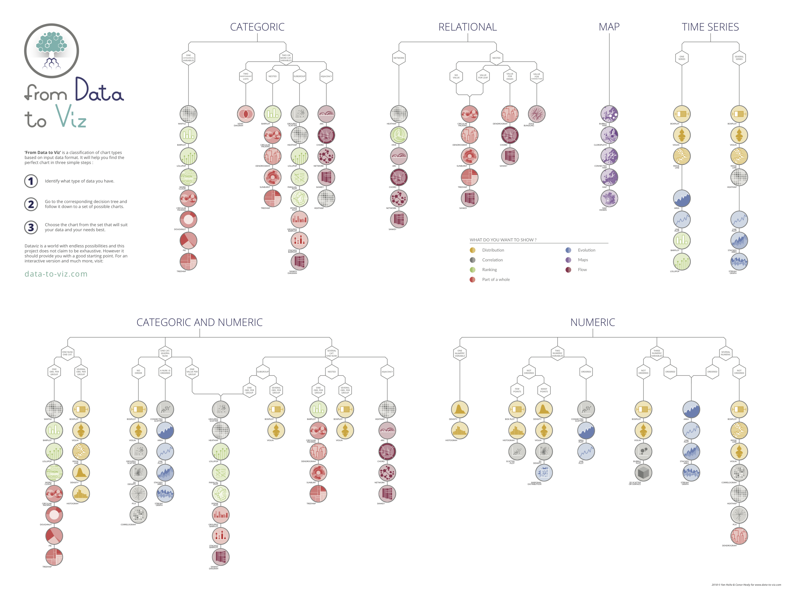

```{r include = FALSE}
htmltools::tagList(rmarkdown::html_dependency_font_awesome())
```

# Welcome to Youreka Canada {-}

Welcome to the Youreka Canada program! In this course, you will learn how to wrangle data, perform statistical tests, and visualize data with R. The purpose of this textbook is to provide a companion to the [Youreka Canada program](https://yourekacanada.org/), which teaches introductory statistics, data science, and research methods. Here, we offer an intuitive approach to data science rather than a rigorous, proof-based course. As such, this textbook does not assume you have any prior knowledge other than basic arithmetic, and it should be accessible to both high school and undergraduate students.


## How to use this textbook {-}

Please note that this text goes into additional detail not covered in session. All optional material is marked as OPTIONAL in the headings. Again, note that this text *complements* the Youreka program. *These notes are not a substitute for attending the Youreka sessions!*

This text focuses on how the material taught in-session can be applied using the R programming language. As with all things programming, the best way to learn is to actively code. That is, when you read this textbook, open RStudio and play around with the presented code---try to find alternative solutions, or even break the code. Don't be afraid to make mistakes, and soon enough, you will be confident to code on your own!


## Contributors {-}

This textbook was written by Eddie Guo, Pouria Torabi, Shuce Zhang, and Devin Aggarwal, who are part of the Youreka Canada Programs Team. A special thanks goes to Matthew Pietrosanu for his critical statistical review of the Youreka program.


## Credit {-}

This material was adapted from:

1. Jennifer Bryan STAT 545 at UBC https://stat545.com/

2. Jennifer Bryan (2017). gapminder: Data from Gapminder. R package version 0.3.0. https://CRAN.R-project.org/package=gapminder


## License {-}

This work is licensed under a [Creative Commons Attribution-ShareAlike 4.0 International License](http://creativecommons.org/licenses/by-sa/4.0/).

<center>
  <i class="fab fa-creative-commons fa-2x"></i><i class="fab fa-creative-commons-by fa-2x"></i><i class="fab fa-creative-commons-sa fa-2x"></i>
</center>

*This is a human-readable summary of (and not a substitute for) the license. Please see <https://creativecommons.org/licenses/by-sa/4.0/legalcode> for the full legal text.*

**You are free to:**

- **Share**---copy and redistribute the material in any medium or format

- **Remix**---remix, transform, and build upon the material for any purpose, even commercially.

The licensor cannot revoke these freedoms as long as you follow the license terms.

**Under the following terms:**

- **Attribution**---You must give appropriate credit, provide a link to the license, and indicate if changes were made. You may do so in any reasonable manner, but not in any way that suggests the licensor endorses you or your use.
  
- **ShareAlike**---If you remix, transform, or build upon the material, you must distribute your contributions under the same license as the original. 

- **No additional restrictions**---You may not apply legal terms or technological measures that legally restrict others from doing anything the license permits.

**Notices:**

You do not have to comply with the license for elements of the material in the public domain or where your use is permitted by an applicable exception or limitation.

No warranties are given. The license may not give you all of the permissions necessary for your intended use. For example, other rights such as publicity, privacy, or moral rights may limit how you use the material.


<!--chapter:end:index.Rmd-->

# (PART) Prerequisites {-}

# Install R and RStudio {#install}

Why do we need to install both R and RStudio? Well, the answer is the following: R is the programming language whereas RStudio is the integrated development environment (IDE) for R. You can think of R as the thing that turns your code into commands that your computer runs and RStudio as a fancy text editor (although it is so much more than that!).


## Installing R

1. Go to the [R Project website](https://www.r-project.org/).
2. On the left side bar, click on "CRAN" under "Download". Choose the mirror you wish to download from (e.g., https://mirror.rcg.sfu.ca/mirror/CRAN/)
3. Download the correct version for your OS. Ensure to download the latest release of R.


## Installing RStudio

1. Go to the [RStudio website](https://rstudio.com/).
2. Navigate to the [RStudio page](https://rstudio.com/products/rstudio/) and download RStudio Desktop.

If you have a pre-existing installation of R and/or RStudio, we **highly recommend** that you update both. If you upgrade R, you'll need to update any packages you have installed. Type the following command into the Console in RStudio:

```{r eval=F}
update.packages(ask = FALSE, checkBuilt = TRUE)
```

Once you've installed an updated version of R and RStudio, open RStudio. You should get a window similar to this [screenshot](https://rstudio.com/wp-content/uploads/2014/04/rstudio-workbench.png), but yours will be more boring because you haven’t written any code or made any figures yet!

Place your cursor in the pane called "Console", which is where you interact with R. Type `print('Hello World!')` in the console and hit the enter or return key. You should see "Hello World!" print to the screen. If you do, you've succeeded in installing R and RStudio.


## Add-on packages

R contains a huge number of packages that enhances its functionality. People often share useful code they have developed as a package via CRAN and GitHub. To install a package from CRAN (e.g., the [tidyverse](https://www.tidyverse.org/)), type this into the R console:

```{r eval=F}
install.packages('tidyverse', dependencies = TRUE)
```

By including `dependencies = TRUE`, we are including any additional packages our target package requires. Please also install [gapminder](https://www.rdocumentation.org/packages/gapminder/), [ggsignif](https://www.rdocumentation.org/packages/ggsignif/), and [ggpubr](https://www.rdocumentation.org/packages/ggpubr/). Without further ado, let's jump into our adventure with R!

<!--chapter:end:01_install.Rmd-->

# Intro to R

We will begin our adventure by opening RStudio. If this is your first time opening RStudio, you should see the following panes:

  * Console (entire left)
  * Environment/History (upper right)
  * Files/Plots/Packages/Help (lower right)

You can change the default location of the panes, among many other things: [Customizing RStudio](https://support.rstudio.com/hc/en-us/articles/200549016-Customizing-RStudio).

For now, place your cursor in the console so we can start coding with R!

## Objects

R is an object-oriented programming language. This means R creates different types of objects that we can manipulate with functions and operators.

To create an object in R, we can assign a value to an object using an **assignment operator** using either a left arrow `<-` or an equal sign `=`. Click the "Run Code" button to get started and play around with the code!

<!---LEARNR EX 1-->

<iframe class="interactive" id="ch1-ex1" src="https://youreka-textbook.shinyapps.io/ch1_ex1/" scrolling="no" frameborder="no"></iframe>

<!------------->

In plain English, the above snippet tells us that "five times ten is assigned to my_object".

By convention, we use `<-` to assign variables. Don't be lazy and use `=` to assign variables. Although it will work, it will just sow confusion later. Code is miserable to read on a good day. Give your eyes a break and use `<-`.

Although object names are flexible, we need to follow some rules:

  1. Object names cannot start with a digit and cannot contain certain other characters such as a comma or a space.
  1. As a general rule of thumb, object names should be short and meaningful. Misleading or overly long object names will make it a pain to debug your code.

Below are examples of various object name conventions. My best advice would be to pick one and stick with it.

```
this_is_snake_case
other.people.use.periods
evenOthersUseCamelCase
```

Let's make another assignment:

```{r long-name}
this_is_a_really_long_name <- 2.5
```

To inspect the object we've just created, try out RStudio's auto-complete feature: type the first few characters, press `TAB`, add characters until you get what you want, then press return/enter.


## Functions

We will use functions in most of our work with R, either pre-written or ones we write ourselves. Functions help us easily repeat instructions and carry out multiple tasks in a single step, saving us a lot of space in our code.

You can call functions like this:

```{r fn-template, eval = FALSE}
functionName(arg1 = val1, arg2 = val2, ...)
```

Notice that we use `=` instead of `<-` within a function. Here, `arg1` and `arg2` are the **arguments** of the function. Likewise, `val1` and `val2` are the **parameters** of `arg1` and `arg2`.

Let's try using `seq()` which makes regular sequences of numbers:

```{r seq-fn}
seq(1, 10)
```

The above snippet also demonstrates something about how R resolves function arguments. You can always specify `name = value` if you're unsure. If you don't, R attempts to resolve by position. In the above snippet, R assumed we wanted a sequence `from = 1` that goes `to = 10`.

As an exercise, try creating a sequence of numbers from 1 to 10 by increments of 2:

<!---LEARNR EX 2-->

<iframe class="interactive" id="ch1-ex2" src="https://youreka-textbook.shinyapps.io/ch1-ex2/" scrolling="no" frameborder="no" style="z-index: 100;"></iframe>

<!------------->

If you just make an assignment, you don't see the assigned value. To show the assigned value, just call the variable.

```{r see-var}
one_to_ten <- seq(1, 10)
one_to_ten
```

You can shorten this common action by surrounding the assignment with parentheses.

```{r see-var-shorten}
(one_to_ten <- seq(1, 10))
```

Not all functions have (or require) arguments:

```{r date-fn}
date()
```

If you've been following along in RStudio, look at your workspace (in the upper right pane.) The workspace is where user-defined objects accumulate. You can also get a listing of these objects with commands:

```{r obj-listing, eval=F}
objects()
ls()
```

If you want to remove the object named `one_to_ten`, you can do this:

```{r rem-obj, eval=F}
rm(one_to_ten)
```

To remove everything:

```{r rem-everything, eval=F}
rm(list = ls())
```

or click the broom icon in RStudio's Environment pane.


## Math operators

Here are some basic math operations you can perform in R. Try playing around with them in the interactive window.

<!---LEARNR EX 3-->

<iframe class="interactive" id="ch1-ex3" src="https://youreka-textbook.shinyapps.io/ch1-ex3/" scrolling="no" frameborder="no" style="z-index: 100;"></iframe>

<!------------->


## Conditionals

Conditional statements check if a condition is true or false using **logical operators** (operators that return either `TRUE` or `FALSE`). For example:

```{r}
20 == 10*2
"hello" == "goodbye"
```

These statements return a value is of type `"logical"`, which is either `TRUE` if the condition is satisfied, or `FALSE` if the condition is not satisfied. One important note is that `TRUE` and `FALSE` are objects on their own, rather than the strings "true" and "false".

Conditional statements are made with a range of logical operators. Here are some examples:

| Operator     | Plain English                                           |
|:-------------|:--------------------------------------------------------|
| `==`         | is equal to                                             |
| `!=`         | is not equal to                                         |
| `<` or `>`   | is less than OR is greater than                         |
| `<=` or `>=` | is less than or equal to OR is greater than or equal to |
| `is.na()`    | is an NA value                                          |

There are other logical operators, including `%in%`, which checks if a value is present in a vector of possible values. Try playing around with the following statements and checking their output by running the code.

<!---LEARNR EX 4-->

<iframe class="interactive" id="ch1-ex4" src="https://youreka-textbook.shinyapps.io/ch1-ex4/" scrolling="no" frameborder="no" style="z-index: 100;"></iframe>

<!------------->

If you're keen, you'll notice in the last line that we use `c()` to group objects together. This *data structure* is called a **vector**. As a brief introduction, vectors <u>**c**</u>ombine objects of the same type. Don't worry too much about the specifics of vectors, as we will cover it in much greater depth in the next chapter.

We can also combine conditions using the logical and (`&`) along with the logical or (`|`). The logical `&` returns `TRUE` if and only if both conditions are true, and it returns `FALSE` otherwise. Let's look at the following examples:

```{r}
# is (5 greater than 2) AND (6 greater than 10)?
(5 > 2) & (6 >= 10)
# is (5 greater than 2) OR (6 greater than 10)?
(5 > 2) | (6 >= 10)
```


### If statements

Conditional statements generate logical values to filter inputs. `if` statements use conditional statements to control flow of a program. Below is the general form of an `if` statement:

```r
if (the conditional statement is TRUE) {
  do something
}
```

Let's look at an example:

<!---LEARNR EX 5-->

<iframe class="interactive" id="ch1-ex5" src="https://youreka-textbook.shinyapps.io/ch1-ex5/" scrolling="no" frameborder="no" style="z-index: 100;"></iframe>

<!------------->

Try assigning 6 to `x` and predict the output.

Although an `if` statement alone is handy, we often want to check multiple conditions. We can add more conditions and associated actions with `else if` statements.

Suppose we want to send an automated message to our friends. Here's how we can do it:

```{r else-if-ex}
friend <- "Jasmine"
if (friend == "Jason") {
  msg <- "Hi, Jason!"
} else if (friend == "Jasmine") {
  msg <- "How are you, Jasmine?"
}
msg
```

We can specify what to do if none of the conditions are `TRUE` by using `else` on its own. Try modifying the code below to print "Stranger danger!" if our friend's name isn't "Jason" or "Jasmine".

<!---LEARNR EX 6-->

<iframe class="interactive" id="ch1-ex6" src="https://tig3r66.shinyapps.io/ch1-ex6/" scrolling="no" frameborder="no" style="z-index: 100;"></iframe>

<!------------->


## Working directory

Any process running on your computer has a notion of its "working directory". By default in R, a working directory is where R will look for files you ask it to load. It is also where any files you write to disk will go. You can explicitly get your working directory with the `getwd()` function:

```{r eval = FALSE}
getwd()
```

The working directory is also displayed at the top of the RStudio console.

You can set your working directory at the command line like so:

```{r eval=F}
setwd("path-to-my-directory/")
```

The `setwd()` function is extremely useful for times you want to read in external data, such as a .csv file.


### Other important things

Below is a collection of important miscellaneous items to consider.

* R scripts are usually saved with a `.R` or `.r` suffix.
* Comments start with one or more `#` symbols. Use them. RStudio helps you (de)comment selected lines with `Ctrl`+`Shift`+`C` (Windows and Linux) or `Command`+`Shift`+`C` (Mac).
* Clean out the workspace. You can do so by clicking the broom icon or by typing `rm(list = ls())` into the console.

This workflow will serve you well in the future:

  1. Create an RStudio project for an analytical project.
  2. Keep inputs there (we'll soon talk about importing).
  3. Keep scripts there; edit them, run them in bits or as a whole from there.
  4. Keep outputs there.

Avoid using your mouse for your workflow. Firstly, using the keyboard is faster. Secondly, writing code instead of clicking helps with reproducibility. That is, it will be much easier to retrospectively determine how a numerical table or PDF was actually produced.

Many experienced users never save the workspace, never save `.RData` files (I'm one of them), and never save or consult the history. Once/if you get to that point, there are options available in RStudio to disable the loading of `.RData` and permanently suppress the prompt on exit to save the workspace (go to *Tools > Options > General*).


<script>
  iFrameResize({}, ".interactive");
</script>

<!--chapter:end:02_intro-to-r.Rmd-->

# Data Structures

In this chapter, we will learn about data structures that will greatly aid our data science workflow.

## Vectors

Vectors are a sequence of values with the **same type**. We can create vectors using `c()`, which stands for "combine".

```{r vec}
(my_nums <- c(2.8, 3.2, 1.5, 3.8))
```

To access the elements inside a vector, we can do something called "slicing". To access a single item or multiple items, use the square bracket operator `[]`. In general `[]` in R means, "give me a piece of something". For example:

```{r basic-subsetting}
my_nums[4]
my_nums[1:3]
my_nums[c(1, 2, 3)] == my_nums[1:3]
```

In `my_nums[1:3]`, the `1:3` creates a vector from 1 to 3, which is then used to subset multiple items in a vector. Here are some additional useful functions:

```{r useful-fns, eval=F}
length(my_nums)
mean(my_nums)
max(my_nums)
min(my_nums)
sum(my_nums)
```

Given the data in the interactive block, consider the following exercises:

1. Select "Pouria" and "Ana" from the `names` vector.
1. Select all individuals who have ages greater than 20. Assume the order of names and ages correlates by index.
1. Select all individuals whose age is not 21.
1. Find the average age of all individuals.

<!---LEARNR EX 1-->

<iframe class="interactive" id="ch2-ex1" src="https://tig3r66.shinyapps.io/ch2-ex1/" scrolling="no" frameborder="no"></iframe>

<!------------->


### Missing values

So far we've worked with data with no missing values. In real life, however, we often have missing values (`NA` values). Unfortunately for us, R does not get along with `NA` values.

```{r missing-vals}
density_ha <- c(2.8, 3.2, 1.5, NA)
mean(density_ha)
```

Why did we get `NA`? Well, it's hard to say what a calculation including `NA` should be, so most calculations return `NA` when `NA` is in the data. One way to resolve this issue is to tell our function to remove the `NA` before executing:

```{r missing-vals-narm}
mean(density_ha, na.rm = TRUE)
```


## Lists

Lists are a vector-like structure that can store other objects/data structures. You can think of it like a vector that holds other vectors.

```{r list-intro}
sites <- c("a", "b", "c")
notes <- "It was a good day in the field today. Warm, sunny, lots of gators."
helpers <- 4
field_notes <- list(sites, notes, helpers)
```

You can index lists in the following ways:

```{r list-index}
field_notes[1]
field_notes[[1]]
```

We can also give the values names and access them using the `$` symbol--which is the preferred method--or via `["variable_name"]` with subsetting. Try getting the `my_sets` vector from `field_notes`.

<!---LEARNR EX 2-->

<iframe class="interactive" id="ch2-ex2" src="https://tig3r66.shinyapps.io/ch2-ex2/" scrolling="no" frameborder="no"></iframe>

<!------------->


## Data frames

This is where things get really exciting! We will use these data structures extensively in the upcoming labs, so it's important to pay attention here.

A data frame is a list of equal length vectors grouped together. More importantly, a data frame can contain both categorical and numerical values, whereas a vector can only contain variables of the same type (i.e., all numerical, all categorical, etc.).

```{R}
sites <- c("a", "a", "b", "c")
area_ha <- c(1, 2, 3, 4)
density_ha <- c(2.8, 3.2, 1.5, NA)
# creating the data frame
surveys <- data.frame(sites, density_ha, area_ha)
surveys
```

Here are some useful commands to investigate a data frame:

  * `str()` returns the structure of a data frame.
  * `length()` returns the length of a data frame.
  * `ncol()` returns the number of columns of a data frame (same as `length()`)
  * `nrow()` returns the number of rows of a data frame.

```{r df-str}
str(surveys)
ncol(surveys)
nrow(surveys)
```

Subsetting data frames is extremely similar to that for vectors. This time, however, we need to consider both rows and columns. We can access a specific member like this: `my_data_frame[row, column]`. Try playing around with the code below :)

<!---LEARNR EX 3-->

<iframe class="interactive" id="ch2-ex3" src="https://tig3r66.shinyapps.io/ch2-ex3/" scrolling="no" frameborder="no"></iframe>

<!------------->


### External data

We can read in external data using the`read.csv()` function. The main argument is the location of the data, which is either a url or a path on your computer.

```{r}
shrub_data <- read.csv('https://datacarpentry.org/semester-biology/data/shrub-dimensions-labeled.csv')
```

### Factors

Let's use the `str()` function to get more information about our variable `shrub_data`.

```{r}
str(shrub_data)
```

Notice that the `shrubID` column has type `Factor`. A factor is a special data type in R for categorical data. Factors are useful for statistics, but can mess up some aspects of computation as we'll see in future chapters.

```{r}
shrub_data <- read.csv('https://datacarpentry.org/semester-biology/data/shrub-dimensions-labeled.csv', stringsAsFactors = FALSE)
str(shrub_data)
```

<script>
  iFrameResize({}, ".interactive");
</script>

<!--chapter:end:03_data-structures.Rmd-->

# Loops and Functions

Loops are fundamental a programming concept as they get a lot of repetitive stuff done in very few lines of code. Paired with custom functions, we can begin to tackle complex programming problems.


## For loops

Here's what the syntax of a `for` loop looks like:

```r
for (item in list_of_items) {
  do_something(item)
}
```

And here is an example:

```{r good-loop}
for (i in 1:5) {
  print(i)
}
```

You can also have multiple lines of code in the body of a loop.

```{r  multi-line-loop}
for (number in 1:5) {
  number <- number*2
  print(number)
}
```

In the previous examples, we used the dummy variables `i` and `number` to take on some range of values. Notice that `i` can be called anything you want.


### Looping over multiple files

We turn our attention now to a (slightly more) useful example: how do we analyze multiple files with similar contents?

In this hypothetical example, we have 5 datasets with satellite coodinates at specific points orbiting the Earth. Suppose the files are similarly named (click on the files to download them):

  * [locations-2016-01-01.txt](./data/04_intro-to-r/locations-2016-01-01.txt)
  * [locations-2016-01-02.txt](./data/04_intro-to-r/locations-2016-01-02.txt)
  * [locations-2016-01-03.txt](./data/04_intro-to-r/locations-2016-01-03.txt)
  * [locations-2016-01-04.txt](./data/04_intro-to-r/locations-2016-01-04.txt)
  * [locations-2016-01-05.txt](./data/04_intro-to-r/locations-2016-01-05.txt)

Our goal is to determine the number of satellite coordinates per file.

First, retrieve the name of each file.

```{r external-files}
data_files <- list.files(path = "data/04_intro-to-r/", pattern = "locations-.*.txt", 
                        full.names = TRUE)
```

Note that the asterisk in `"*.txt"` refers to "any name in this directory" whereas the `".txt"` part ensures we are only selecting .txt files.

Next, determine the number of observations in each file. We will assume that each row corresponds to a single coordinate.

```{r get-count}
results <- vector(mode = "integer", length = length(data_files))
for (i in 1:length(data_files)) {
  data <- read.csv(data_files[i])
  count <- nrow(data)
  results[i] <- count
}
```

Now, store the output in a data frame and associate the file name with the count.

```{r show-count-results}
results <- data.frame(file_name = character(length(data_files)),
                      count = integer(length(data_files)),
                      stringsAsFactors = FALSE)

for (i in 1:length(data_files)){
  data <- read.csv(data_files[i])
  count <- nrow(data)
  results$file_name[i] <- data_files[i]
  results$count[i] <- count
}
results
```


### Nested loops

Sometimes, we need to loop over more than a single range of numbers. For example, what if we want to select all pixels on a 2x3 rectangular screen? Here, we need to cover both the "x" and "y" pixel coodinates:

```{R}
for (i in 1:2) {
  for (j in 1:3) {
    print(paste("i = " , i, "; j = ", j, sep=""))
  }
}
```


## Functions

Sometimes, we will need to create custom functions. Luckily, we can define our own functions!

This is the general syntax for a function:
  
```{r eval=F}
function_name <- function(arguments) {
  output_value <- do_something(inputs)
  return(output_value)
}
```

**Remark:** every function *returns* a value. Recall from your grade-school math class that functions take an input and return an output. In R, however, a function may or may not take user-defined input.

This brings me to an extremely important point: **creating a function does NOT run it. You must call the function to run it.**
  
A function is meant to be reusable---treat it as such.

```{r call-func}
# define the function
calc_shrub_vol <- function(length, width, height) {
  area <- length * width
  volume <- area * height
  return(volume)
}
# call the function
calc_shrub_vol(0.8, 1.6, 2.0)
```

As always, to save a function's return value, you need to store the output in an appropriate data structure.

```{r store-func-output}
shrub_vol <- calc_shrub_vol(0.8, 1.6, 2.0)
```

A helpful tip is to treat functions like a black box---the only things a function "knows" are the inputs we pass it. Likewise, the only thing R "knows" about a function is the output the function returns.

Let's walk through `calc_shrub_vol()`'s  execution (key terms are in bold):

  1. **Call** the `calc_shrub_vol()` function. Within the function,
      a) Assign 0.8 to `length`, 1.6 to `width`, and 2.0 to `height` *inside* the function.
      b) Calculate the area and assign it to `area`.
      c) Calculate volume and assign it to `volume`.
      d) **Return** `volume` as the function output.
  2. Assign the function's output to a new variable called `shrub_vol`.

Since R treats functions like a black box, you can't access a variable that was created in a function. You **must** save the output of a function (to a variable) to use it later.


### Conditionals within functions

Recall that we used a conditional to estimate mass differently for different types of vegetation. Since this is the kind of code we are going to want to reuse, let's move it into a function.

```{R}
est_mass <- function(volume, veg_type) {
  if (veg_type == "tree") {
    mass <- 2.65 * volume^0.9
  } else if (veg_type == "grass") {
    mass <- 0.65 * volume^1.2
  } else {
    mass <- NA
  }
  return(mass)
}
```

We can then run this function with different vegetation types and get different estimates for mass.

```{R}
est_mass(1.6, "tree")
est_mass(1.6, "grass")
est_mass(1.6, "shrub")
```

Let's walk through how `est_mass(1.6, "shrub")` executes:

  1. When we call `est_mass()`, the function assigns `1.6` to `volume` and `"shrub"` to `veg_type`.
  1. The function checks if `veg_type` is equal to `"tree"`.
  1. It isn't, so it checks if `veg_type` is equal to `"grass"`.
  1. It isn't, so it goes to the `else` statement and executes the code in that block. Hee, the function assigns`NA` to `mass`.
  1. The function exits the if/else if/else blocks and returns the value for `mass`, which is `NA`.


### Nested conditionals

Occasionally, we need to make complex decisions that can't be captured using a simple if/else if/else statement. For example, we might have different equations for some vegetation types based on the age of the plant. To solve this problem, we can "nest" conditionals inside of one another.

```{R}
est_mass <- function(volume, veg_type, age) {
  if (veg_type == "tree") {
    # nested condition
    if (age < 5) {
      mass <- 1.6 * volume^0.8
    } else {
      mass <- 2.65 * volume^0.9
    }
  } else if (veg_type == "grass" | veg_type == "shrub") {
    mass <- 0.65 * volume^1.2
  } else {
    mass <- NA
  }
  return(mass)
}
```

```{r call-est_mass}
est_mass(1.6, "tree", age = 2)
est_mass(1.6, "shrub", age = 5)
```

Try to minimize nested functions whenever possible as it can be difficult to read.


### Function arguments

As seen previously, we can use custom inputs by defining an input argument. As lazy programmers, we usually want to call a function without typing much. This is where **default arguments** come in handy. For example, many of our shrubs are the same height so for those shrubs we only measure the `length` and `width`. We can set a default value for shrub height for cases where we don't measure it.

```{R}
calc_shrub_vol <- function(length, width, height = 1) {
  area <- length * width
  volume <- area * height
  return(volume)
}

calc_shrub_vol(0.8, 1.6)  # default argument for height
calc_shrub_vol(0.8, 1.6, 2.0)  # default argument is overridden by 2,0
calc_shrub_vol(length = 0.8, width = 1.6, height = 2.0)
```

As you could tell from the last two examples, you can override the default argument by providing your own value.

Here are some additional points:

  1. You can always use names to assign a parameter to an argument.
  2. If not, using names then order is determined by parameter order. For example,
      * First value is `length`, second value is `width`, third value is `height`.
  3. In many cases there are *a lot* of optional arguments. In this case, we can specify an argument by name to avoid confusion.
  4. Oftentimes, only the optional arguments are specified (i.e., those without a default value).

In our case, we would write:

```{R}
calc_shrub_vol(0.8, 1.6, height = 2.0)
```

### Combining functions

Here are some guidelines for creating good functions:

  * Each function should be single conceptual chunk of code.
  * Functions can be combined to perform larger tasks.

```{R}
est_shrub_mass <- function(volume) {
  mass <- 2.65 * volume^0.9
}

shrub_volume <- calc_shrub_vol(0.8, 1.6, 2.0)
shrub_mass <- est_shrub_mass(shrub_volume)
```

We can nest functions. Below, the inner function executes before the outer function executes.

```{R}
shrub_mass <- est_shrub_mass(calc_shrub_vol(0.8, 1.6, 2.0))
```

We need to be careful with this because nesting code can be difficult to read. As a general rule of thumb, don't nest more than two functions.

We can also call functions from inside other functions. This allows us to organize function calls into logical groups.

```{R}
est_shrub_mass_dim <- function(length, width, height) {
  volume <- calc_shrub_vol(length, width, height)
  mass <- est_shrub_mass(volume)
  return(mass)
}

est_shrub_mass_dim(0.8, 1.6, 2.0)
```

Now that we've got the basics of R under our belts, we can jump into the fun data science applications `r emo::ji("smile")`

<script>
  iFrameResize({}, ".interactive");
</script>

<!--chapter:end:04_loops.Rmd-->

# (PART) Data Wrangling {-}

# Gapminder and dplyr

Whenever you have rectangular, "spreadsheetey" data, your default data structure in R should be the **data frame**. Do not depart from this without good reason. Data frames are awesome because

  1. They neatly package related variables and maintain a "row-ordering" like that in a spreadsheet. This makes it easy to apply filters to rows and columns of interest.
  2. Most functions for inference, modelling, and graphing will happily take a data frame object.
  3. The set of packages known as the [tidyverse](https://www.tidyverse.org/) takes data frames one step further and explicitly prioritizes the processing of data frames.

Data frames, unlike general arrays or matrices in R, can hold variables of different flavours. For example, data frames can simultaneously hold *character data* (e.g., subject ID or name), *quantitative data* (e.g., white blood cell count), and *categorical information* (e.g., treated vs. untreated).

If you use data structures that can only hold 1 type of data (e.g., matrices) for data analysis, you are likely to make the terrible mistake of spreading a dataset out over multiple, unlinked objects. Why? Because you can't put character data, such as subject name, into the numeric matrix that holds white blood cell count. This fragmentation is a bad idea.


## Get the gapminder data

We will work with some of the data from the [Gapminder project](https://www.gapminder.org/). The Gapminder project contains the gapminder dataset, which summarises the progression of countries over time for statistics like life expectancy and GDP.

If you haven't installed gapminder yet, you can do so like this:

```{r eval = FALSE}
install.packages("gapminder")
```

Now load the package.

```{r}
library(gapminder)
```


## Explore gapminder

By loading the gapminder package, we now have access to a data frame by the same name. Get an overview of the data frame with `str()`, which displays the structure of an object.

```{r}
str(gapminder)
```

`str()` will provide a sensible description of almost anything and, worst case, nothing bad can actually happen. When in doubt, just use `str()` on your recently created objects to get ideas about what to do next.

We could print the `gapminder` object itself to screen. However, if you've used R before, you might be reluctant to do this, because large datasets fill your Console and provide very little insight.

If you have not already done so, install the tidyverse meta-package now:

```{r eval = FALSE}
install.packages("tidyverse")
```

Now load it:

```{r, message = F, warning = F}
library(tidyverse)
class(gapminder)
```

We can now print gapminder! Notice that the **class** (type of data structure) of the gapminder object is a **tibble**, the tidyverse's version of R's data frame. A tibble is also a data frame.

```{r}
gapminder
```

Although this seems like a lot of output, notice that tibbles provide a nice print method that shows the most important stuff and doesn't fill up your console. Let's make sense of the output:

  1. The first line refers to what we're printing---a tibble with 1704 rows and 6 columns.
  2. Below each column heading, we see `<fct>   <fct>   <int>   <dbl>   <int>   <dbl>`. These refer to the **variable type** of that column.
      a. `fct` is a factor (kind of like a categorical variable), `int` stands for integer, and `dbl` stands for double (a number with decimal places).

If you're only interested in the first or last couple of rows, use `head()` or `tail()`.

  1. `head()` displays the first 6 rows of your data frame by default, and
  2. `tail()` shows the last 6 rows.

```{r}
head(gapminder)
tail(gapminder)
```

You can also specify the number of rows displayed by passing in a number.

```{r, eval}
head(gapminder, n = 3)
```

Just for your reference, if you want to change a data frame into a tibble for nicer printing, use `as_tibble()`!

```{r, eval = FALSE}
as_tibble(my_data_frame)  # my_data_frame is the thing we want to make a tibble
```

Here are more ways to query basic info on a data frame:

| Function  | Description                       |
|:----------|:----------------------------------|
| `names()` | returns column names              |
| `ncol()`  | returns number of columns         |
| `nrow()`  | returns number of rows            |
| `dim()`   | returns # of rows by # of columns |

```{r}
names(gapminder)
ncol(gapminder)
nrow(gapminder)
dim(gapminder)
```

A statistical summary of the data can be obtained with `summary()`. That is, each column's statistics are shown separately.

```{r}
summary(gapminder)
```


### Importing and exporting data

We can export the data frame to a comma-separated values (.csv) file.

```{r}
write.csv(gapminder, file = "data/03_data-frames/gapminder.csv")
```

The ".csv" extension stands for comma-separated values. This is the preferred way of importing and exporting data as it contains no formatting. You can also import a .csv file to Excel.

On top of writing to a .csv file, we can also read .csv files into R. It's as simple as `read.csv()`!

```{r}
gapminder2 <- read.csv("data/03_data-frames/gapminder.csv", header = TRUE)
class(gapminder2)
```

As you can see,`read.csv()` returns a data frame object by default.


### Exploring variables in a data frame

To specify a single variable from a data frame, use the dollar sign `$`. Let's explore the numeric variable for life expectancy.

```{r histogram-lifeExp}
head(gapminder$lifeExp)
summary(gapminder$lifeExp)
hist(gapminder$lifeExp)
```

Don't worry too much about the code to make the figures right now---we will learn how to visualize data in future lectures. For now, let's continue to explore gapminder.

Take a look at the `year` variable:

```{r}
class(gapminder$year)
```

Notice that `year` holds integers. On the other hand, `continent` holds categorical information, which is called a **factor** in R.

```{r}
class(gapminder$continent)
```

Now, I want to illustrate something important:

```{r}
summary(gapminder$year)
summary(gapminder$continent)
```

Notice that the same function returned different outputs for different variable types---forgetting this observation can lead to confusion in the future, so make sure to check your data before analysis! Let's check out a couple more useful functions and highlight important ideas in the meantime.

Within a given column/variable,

  1. `table()` returns the number of observations,
  2. `levels()` returns unique values, and
  3. `nlevels()` returns the number of unique values.

```{r}
table(gapminder$continent)
levels(gapminder$continent)
nlevels(gapminder$continent)
```

The **levels** of the factor `continent` are "Africa", "Americas", etc.---this is what's usually presented to your eyeballs by R. Behind the scenes, R assigns integer values (i.e., 1, 2, 3, ...) to each level. *Never ever ever* forget this fact. Look at the result from `str(gapminder$continent)` if you are skeptical:

```{r}
str(gapminder$continent)
```

Specifically in modelling and figure-making, factors are anticipated and accommodated by the functions and packages you will want to exploit. Note that factors do NOT contain integers. Factors are a numerical way that R uses to represent categorical data.

Tl;dr, factors are categorical variables whereas levels are unique values within a factor.


### Data frame summary

Use data frames and the [`tidyverse`](https://www.tidyverse.org/)!! The `tidyverse` provides a special type of data frame called a "tibble" that has nice default printing behavior, among other benefits.

  * When in doubt, `str()` something or print something.
  * Always understand the basic extent of your data frames: number of rows and columns.
  * Understand what your variable types are.
  * Use factors!! (but with intention and care)
  * Do basic statistical and visual sanity checking of each variable.
  * Refer to variables by name (ex: `gapminder$lifeExp`) and NOT by column number. Your code will be more robust and readable.


## Data frames with dplyr

`dplyr` is a package for data manipulation developed by Hadley Wickham and Romain Francois. It is built to be fast, highly expressive, and open-minded about how your data is stored. It is installed as part of the the [`tidyverse`](https://github.com/hadley/tidyverse) meta-package and it is among the packages loaded via `library(tidyverse)`.

Here's a bit of fun trivia: `dplyr` stands for "**d**ata frame **p**liers".


### Subsetting data

If you feel the urge to store a little snippet of your data:

```{r}
canada <- gapminder[241:252, ]
```

Stop and ask yourself ...

> Do I want to create a separate subset of my original data?

If "YES," **use proper data aggregation techniques or don’t subset the data.** Alternatively, only subset the data as a *temporary measure* while you develop your elegant code.

If "NO," then don't subset!

Copies and excerpts of your data clutter your workspace, invite mistakes, and sow general confusion. Avoid whenever possible. Reality can also lie somewhere in between. You will find the workflows presented below can help you accomplish your goals with minimal creation of temporary, intermediate objects.

Recall the`rm()` function, which removes unwanted variable(s).

```{r, eval = FALSE}
x <- 'thing to not keep'
print(x)
rm(x)
# print(x)  # gives an error because x is deleted
```


### Filter rows with `filter()`

`filter()` takes logical expressions and returns the rows for which all are `TRUE`. Use this when you want to subset observations based on values.

The first argument is the name of the data frame. The subsequent arguments are the expressions that filter the dataframe. For example, let's filter all rows from `gapminder` where life expectancy is less than 29 years.

```{r}
filter(gapminder, lifeExp < 29)
```

When you run this line of code, `dplyr` filters the data and returns a new data frame. `dplyr` functions never modify their inputs, so if you want to save the result, you need to use the assignment operator, `<-`. Let's try this out! Here we filter based on `country` and `year`:

```{r}
rwanda_gthan_1979 <- filter(gapminder, country == "Rwanda", year > 1979)
```

Compare with some base R code to accomplish the same things:

```{r eval = FALSE}
gapminder[gapminder$lifeExp < 29, ]     # indexing is distracting
subset(gapminder, country == "Rwanda")  # almost same as filter; quite nice actually
```

What if you want to filter rows based on multiple values in a variable? For example, what if we want to filter all rows with either Rwanda or Afghanistan as countries?

```{r eval = FALSE}
filter(gapminder, country == "Rwanda" | country == "Afghanistan")
```

Here we use a Boolean operator, `|`, which means "or". Boolean operators always return either `TRUE` or `FALSE`. Some other common ones are `&` (and) and `!` (not).

What if we want to keep more than just 2 countries? One way would be to string Boolean operators together like so: `country == "Canada" | country == "Rwanda" | country == "Afghanistan | ...` This, however, is very wordy. A useful shortcut is to use `x %in% y`. This selects every row where `x` is one of the values in `y`:

```{r, eval = FALSE}
filter(gapminder, country %in% c("Rwanda", "Afghanistan"))
filter(gapminder, country %in% c("Canada", "Rwanda", "Afghanistan"))
```

Under no circumstances should you subset your data the way I did at first:

```{r eval = FALSE}
excerpt <- gapminder[241:252, ]
```

Why is this a terrible idea?

  * It is not self-documenting. What is so special about rows 241 through 252?
  * It is fragile. This line of code will produce different results if someone changes the row order of `gapminder`, e.g. sorts the data earlier in the script.
  
```{r eval = FALSE}
filter(gapminder, country == "Canada")
```

This call explains itself and is fairly robust.

### Pipe operator `%>%`

Before we go any further, we should exploit the new pipe operator that the tidyverse imports from the [`magrittr`](https://github.com/smbache/magrittr) package by Stefan Bache. Here's what it looks like: `%>%`. The RStudio keyboard shortcut: Ctrl + Shift + M (Windows), Cmd + Shift + M (Mac).

Let's demo then I'll explain:

```{r}
gapminder %>% head()
```

The above code is equivalent to `head(gapminder)`. The pipe operator takes the thing on the left-hand-side and __pipes__ it into the function call on the right-hand-side. It literally drops it in as the first argument. You can think of an argument as your input to a function. If you remember your grade school math, functions in R do exactly what you've learned in school -- it takes inputs (arguments/parameters) and spits an output, or a return value.

Never fear, you can still specify other arguments to this function! To see the first 3 rows of Gapminder, we could say `head(gapminder, 3)` or this:

```{r}
gapminder %>% head(3)
```

You are probably not impressed yet, but the magic will happen soon.

### Select Columns with `select()`

Use `select()` to subset the data on variables or columns. Here's a conventional call:

```{r}
select(gapminder, year, lifeExp)
```

And here's the same operation, but written with the pipe operator and piped through `head()`:

```{r}
gapminder %>%
  select(year, lifeExp) %>%
  head(4)
```

Think: "Take `gapminder`, then select the variables year and lifeExp, then show the first 4 rows."

If we didn't have the pipe operator, this is what the above function would look like:

```{r}
head(select(gapminder, year, lifeExp), 4)
```

As you can see, this is way harder to read. That's why the pipe operator is so useful.

An important note is that select does not actually filter any rows. It simply selects columns.

`select()` used alongisde `everything()` is also quite handy if you want to move variables within your data frame. The `everything()` function selects all variables not explicitly mentioned in `select()`. For example, let's move `year` and `continent` to the front of the `gapminder` tibble:

```{r}
select(gapminder, year, continent, everything())
```


Here's the data for Cambodia, but only certain variables...

```{r}
gapminder %>%
  filter(country == "Cambodia") %>%
  select(year, lifeExp)
```

... and what a typical base R call would look like:

```{r}
gapminder[gapminder$country == "Cambodia", c("year", "lifeExp")]
```

### Pure, predictable, pipeable (OPTIONAL)

We've barely scratched the surface of `dplyr` but I want to point out key principles you may start to appreciate. If you're new to R or "programming with data", feel free skip this section.

`dplyr`'s verbs, such as `filter()` and `select()`, are what's called [pure functions](http://en.wikipedia.org/wiki/Pure_function). To quote from Wickham's [Advanced R Programming book](http://adv-r.had.co.nz/Functions.html):

> The functions that are the easiest to understand and reason about are pure functions: functions that always map the same input to the same output and have no other impact on the workspace. In other words, pure functions have no side effects: they don’t affect the state of the world in any way apart from the value they return.

And finally, the data is **always** the very first argument of every dplyr function.


### Additional resources

`dplyr` official stuff

  * package home [on CRAN](http://cran.r-project.org/web/packages/dplyr/index.html)
    - note there are several vignettes, with the [introduction](http://cran.r-project.org/web/packages/dplyr/vignettes/introduction.html) being the most relevant right now
    - the [one on window functions](http://cran.rstudio.com/web/packages/dplyr/vignettes/window-functions.html) will also be interesting to you now
  * development home [on GitHub](https://github.com/hadley/dplyr)
  * [tutorial HW delivered](https://www.dropbox.com/sh/i8qnluwmuieicxc/AAAgt9tIKoIm7WZKIyK25lh6a) (note this links to a DropBox folder) at useR! 2014 conference

[RStudio Data Wrangling cheatsheet](https://www.rstudio.com/wp-content/uploads/2015/02/data-wrangling-cheatsheet.pdf), covering `dplyr` and `tidyr`. Remember you can get to these via *Help > Cheatsheets.* 

[Excellent slides](https://github.com/tjmahr/MadR_Pipelines) on pipelines and `dplyr` by TJ Mahr, talk given to the Madison R Users Group.

Blog post [Hands-on dplyr tutorial for faster data manipulation in R](http://www.dataschool.io/dplyr-tutorial-for-faster-data-manipulation-in-r/) by Data School, that includes a link to an R Markdown document and links to videos

[Cheatsheet](https://rstudio.com/wp-content/uploads/2015/02/data-wrangling-cheatsheet.pdf) from R Studio for `dplyr`.

<!--chapter:end:05_data-frames.Rmd-->

# More dplyr

## Review and preparation

In the previous chapter, we introduced three important data wrangling  concepts:

  1. `filter()` for subsetting rows
  2. `select()` for subsetting columns (i.e., variables)
  3. The pipe operator `%>%`, which feeds the left-hand side as the first argument to the expression on the right-hand side

We also discussed dplyr's role inside the tidyverse and tibbles:

  * `dplyr` is a core package in the [tidyverse](https://github.com/hadley/tidyverse) meta-package. Since we often make incidental usage of the others, we will load dplyr and the others via `library(tidyverse)`.
  * The `tidyverse` embraces a special flavor of data frame, called a tibble. The `gapminder` dataset is stored as a tibble.

Let's load the tidyverse and gapminder.

```{r, message = F, warning = F}
library(tidyverse)
library(gapminder)
```

We're going to make changes to the `gapminder` tibble. To eliminate any fear that you're damaging the data that comes with the package, let's create an explicit copy of `gapminder` for our experiments. Don't worry if you modify the gapminder package, since your changes are temporary (i.e., you can reload the gapminder to get a fresh dataset).

```{r}
my_gap <- gapminder
```

**Pay close attention** when we evaluate statements but let the output just print to screen...

```{r}
## let output print to screen, but do not store
my_gap %>% filter(country == "Canada")
```

... versus when we assign the output to a new variable, or overwritting one that already exists.

```{r}
## store the output as an R object
my_precious <- my_gap %>% filter(country == "Canada")
```


## Use mutate() to add new variables

Imagine we wanted to recover each country's GDP. After all, the Gapminder data has a variable for population and GDP per capita. Let’s multiply them together to get the GDP of the whole country.

The `mutate()` function defines and inserts new variables into a data frame/tibble. You can refer to existing variables by name.

```{r}
my_gap %>% mutate(gdp = pop * gdpPercap)
```

If you don't want to add a new column to your tibble, you can use `transmute()`. It works just like `mutate()` except it only keeps the column(s) you specify.

Let's save our output in a new tibble called `gap_gdp`. Recall that saving the return of functions generally suppresses printing to the console. If you want to see the output, either type or print the variable.

```{r}
gap_gdp <- my_gap %>% transmute(country, gdp = pop * gdpPercap)
gap_gdp  # or use print(gap_gdp)
```

Hmmm... those GDP numbers are almost uselessly large and abstract. Consider the [advice of Randall Munroe of xkcd](http://fivethirtyeight.com/datalab/xkcd-randall-munroe-qanda-what-if/):

>One thing that bothers me is large numbers presented without context... 'If I added a zero to this number, would the sentence containing it mean something different to me?' If the answer is 'no,' maybe the number has no business being in the sentence in the first place."

Maybe it would be more meaningful to consumers of my tables and figures to stick with GDP per capita. But what if I reported GDP per capita, *relative to some benchmark country*. Since Canada is my home country, I'll go with that.

I need to create a new variable that is `gdpPercap` divided by Canadian `gdpPercap`, taking care that I always divide two numbers that pertain to the same year.

Here is what we need to do:

  1. Filter down to the rows for Canada.
  2. Create a new temporary variable in `my_gap`:
      a. Extract the `gdpPercap` variable from the Canadian data.
      b. Replicate it once per country in the dataset, so it has the right length.
  3. Divide raw `gdpPercap` by this Canadian figure.
  4. Discard the temporary variable of replicated Canadian `gdpPercap`.

```{r}
ctib <- my_gap %>% filter(country == "Canada")
## this is a semi-dangerous way to add this variable
## I'd prefer to join on year, but we haven't covered joins yet
my_gap <- my_gap %>%
  mutate(tmp = rep(ctib$gdpPercap, nlevels(country)),
         gdpPercapRel = gdpPercap / tmp,
         tmp = NULL)
```

Note that, `mutate()` builds new variables sequentially so you can reference earlier ones (like `tmp`) when defining later ones (like `gdpPercapRel`). Also, you can get rid of a variable by setting it to `NULL`.

How could we sanity check that this worked? The Canadian values for `gdpPercapRel` better all be 1!

```{r}
my_gap %>% 
  filter(country == "Canada") %>% 
  select(country, year, gdpPercapRel)
```

I perceive Canada to be a "high GDP" country, so I predict that the distribution of `gdpPercapRel` is located below 1, possibly even well below. Check your intuition!

```{r}
summary(my_gap$gdpPercapRel)
```

The relative GDP per capita numbers are, in general, well below 1. We see that most of the countries covered by this dataset have substantially lower GDP per capita, relative to Canada, across the entire time period.

Remember: Trust No One. Including (especially?) yourself. Always try to find a way to check that you've done what meant to. Prepare to be horrified.

## Use arrange() to row-order data

The `arrange()` function reorders rows in a data frame/tibble. Imagine you wanted this data ordered by year then country, as opposed to by country then year. Remember, to save the output, you must assign it to a variable.

```{r}
my_gap %>% arrange(year, country)
```

Or maybe you want just the data from 2007, sorted on life expectancy?

```{r}
my_gap %>%
  filter(year == 2007) %>%
  arrange(lifeExp)
```

Oh, you'd like to sort on life expectancy in **desc**ending order? Then use `desc()`.

```{r}
my_gap %>%
  filter(year == 2007) %>%
  arrange(desc(lifeExp))
```

I advise that your analyses NEVER rely on rows or variables being in a specific order. But it's still true that human beings write the code and the interactive development process can be much nicer if you reorder the rows of your data as you go along. Also, once you are preparing tables for human eyeballs, it is imperative that you step up and take control of row order.

## Use rename() to rename variables

When I started programming, I was a [camelCase](http://en.wikipedia.org/wiki/CamelCase) person, but now I'm all about [snake_case](http://en.wikipedia.org/wiki/Snake_case). Let's rename some variables!

```{r}
my_gap %>%
  rename(life_exp = lifeExp,
         gdp_percap = gdpPercap,
         gdp_percap_rel = gdpPercapRel)
```

I did NOT assign the post-rename object back to `my_gap` because that would make the chunks in this tutorial harder to copy/paste and run out of order. In real life, I would probably assign this back to `my_gap`, in a data preparation script, and proceed with the new variable names.

### Use select() to rename and reposition variables

You've seen simple uses of `select()`. There are two tricks you might enjoy:

  1. `select()` can rename the variables you request to keep.
  2. `select()` can be used with `everything()` to hoist a variable up to the front of the tibble.

```{r}
my_gap %>%
  filter(country == "Burundi", year > 1996) %>% 
  select(yr = year, lifeExp, gdpPercap) %>% 
  select(gdpPercap, everything())
```

`everything()` is one of several helpers for variable selection. Read the documentation to see the rest.

## Perform tasks on subsets with `group_by()` 

I have found collaborators love to ask seemingly innocuous questions like, "which country experienced the sharpest 5-year drop in life expectancy?". In fact, that is a totally natural question to ask. But if you are using a language that doesn't know about data, it's an incredibly annoying question to answer.

`dplyr` offers powerful tools to solve this class of problem.

  * `group_by()` adds extra structure to your dataset -- grouping information -- which lays the groundwork for computations within the groups.
  * `summarize()` takes a dataset with $n$ observations, computes requested summaries, and returns a dataset with 1 observation.
  * Window functions take a dataset with $n$ observations and return a dataset with $n$ observations.
  * You can also do very general computations on your groups with `do()`.
  
Combined with the verbs you already know, these new tools allow you to solve an extremely diverse set of problems with relative ease.

### Counting

Let's start with simple counting. How many observations do we have per continent? The `n()` function counts the number of observations in a particular group.

```{r}
my_gap %>%
  group_by(continent) %>%
  summarize(n = n())
```

Let us pause here to think about the `tidyverse`. You could get these same frequencies using `table()` from base R.

```{r}
table(gapminder$continent)
str(table(gapminder$continent))
```

But the object of class `table` that is returned makes downstream computation a bit fiddlier than we would like. For example, it's too bad the continent levels come back only as *names* and not as a proper factor, with the original set of levels.

The `tally()` function is a convenient function that counts rows.

```{r}
my_gap %>%
  group_by(continent) %>%
  tally()
```

The `count()` function is an even more convenient function that does both grouping and counting.

```{r}
my_gap %>% count(continent)
```

What if we wanted to add the number of unique countries for each continent? You can compute multiple summaries inside `summarize()`. Use the `n_distinct()` function to count the number of distinct countries within each continent.

```{r}
my_gap %>%
  group_by(continent) %>%
  summarize(n = n(),
            n_countries = n_distinct(country))
```

### General summarization

The functions you'll apply within `summarize()` include classical statistical summaries, like  `mean()`, `median()`, `var()`, `sd()`, `mad()`, `IQR()`, `min()`, and `max()`. Remember they are functions that take $n$ inputs and distill them down into 1 output.

Although this may be statistically ill-advised, let's compute the average life expectancy by continent.

```{r}
my_gap %>%
  group_by(continent) %>%
  summarize(avg_lifeExp = mean(lifeExp))
```

`summarize_at()` applies the same summary function(s) to multiple variables. Let's compute average and median life expectancy and GDP per capita by continent by year ... but only for 1952 and 2007.

```{r, warning = F}
my_gap %>%
  filter(year %in% c(1952, 2007)) %>%
  group_by(continent, year) %>%
  summarize_at(vars(lifeExp, gdpPercap), funs(mean, median))
```

Let's focus just on Asia. What are the minimum and maximum life expectancies seen by year?

```{r}
my_gap %>%
  filter(continent == "Asia") %>%
  group_by(year) %>%
  summarize(min_lifeExp = min(lifeExp), max_lifeExp = max(lifeExp))
```

Of course it would be much more interesting to see *which* country contributed these extreme observations. Is the minimum (maximum) always coming from the same country?We will tackle this with window functions shortly.

### Computing with group-wise summaries

Don't worry too much about this section if all the data wrangling is starting to become overwhelming -- it's mainly here for the curious.


Let's make a new variable that is the years of life expectancy gained (lost) relative to 1952, for each individual country. We group by country and use `mutate()` to make a new variable. The `first()` function extracts the first value from a vector. Notice that `first()` is operating on the vector of life expectancies *within each country group*.

```{r}
new_var <- my_gap %>%
  group_by(country) %>% 
  select(country, year, lifeExp) %>% 
  mutate(lifeExp_gain = lifeExp - first(lifeExp)) %>% 
  filter(year < 1963)
new_var
```

Within country, we take the difference between life expectancy in year $i$ and life expectancy in 1952. Therefore we always see zeroes for 1952 and, for most countries, a sequence of positive and increasing numbers.

### Window functions (OPTIONAL)

Window functions take $n$ inputs and give back $n$ outputs. Furthermore, the output depends on all the values. So `rank()` is a window function but `sum()` is not. Here we use window functions based on ranks and offsets.

Let's revisit the worst and best life expectancies in Asia over time, but retaining info about *which* country contributes these extreme values.

```{r}
my_gap %>%
  filter(continent == "Asia") %>%
  select(year, country, lifeExp) %>%
  group_by(year) %>%
  filter(min_rank(desc(lifeExp)) < 2 | min_rank(lifeExp) < 2) %>% 
  arrange(year)
```

We see that (min = Afghanistan, max = Japan) is the most frequent result, but Cambodia and Israel pop up at least once each as the min or max, respectively. That table should make you impatient for our upcoming work on tidying and reshaping data! Wouldn't it be nice to have one row per year?

How did that actually work? First, I store and view a partial that leaves off the `filter()` statement. All of these operations should be familiar.

```{r}
asia <- my_gap %>%
  filter(continent == "Asia") %>%
  select(year, country, lifeExp) %>%
  group_by(year)
asia
```

Now we apply a window function: `min_rank()`. Since `asia` is grouped by year, `min_rank()` operates within mini-datasets, each for a specific year. Applied to the variable `lifeExp`, `min_rank()` returns the rank of each country's observed life expectancy.

FYI, the `min` part just specifies how ties are broken. Here is an explicit peek at these within-year life expectancy ranks, in both the (default) ascending and descending order. If you specify `rank()`, ties will be denoted by .5. For instance:

```{r}
x <- c(1, 2, 3, 3, 4)
min_rank(x)
rank(x)
```

For concreteness, I use `mutate()` to actually create these variables, even though I dropped this in the solution above. Let's look at a bit of that.

```{r}
asia %>%
  mutate(le_rank = min_rank(lifeExp),
         le_desc_rank = min_rank(desc(lifeExp))) %>% 
  filter(country %in% c("Afghanistan", "Japan", "Thailand"), year > 1995)
```

Afghanistan tends to present 1's in the `le_rank` variable, Japan tends to present 1's in the `le_desc_rank` variable and other countries, like Thailand, present less extreme ranks.

You can understand the original `filter()` statement now:

```{r eval = FALSE}
filter(min_rank(desc(lifeExp)) < 2 | min_rank(lifeExp) < 2)
```

These two sets of ranks are formed on-the-fly, within year group, and `filter()` retains rows with rank less than 2, which means ... the row with rank = 1. Since we do for ascending and descending ranks, we get both the min and the max.

If we had wanted just the min OR the max, an alternative approach using `top_n()` would have worked.

```{r}
my_gap %>%
  filter(continent == "Asia") %>%
  select(year, country, lifeExp) %>%
  arrange(year) %>%
  group_by(year) %>%
  #top_n(1, wt = lifeExp)       ## gets the max
  top_n(1, wt = desc(lifeExp))  ## gets the min
```


## Introduction to visualization (OPTIONAL)

Although we will get into more serious plotting in future chapters, I want to give you a taste of the excitement to come.

Here, we will get sampling of the almighty `ggplot2` package. Let's look at a few basic examples. 

If you want to compare continuous data with a few categories, either a bar plot or box plot would be a good bet. Let's look at the 1952 gapminder data.

```{r}
dat.1952 <- my_gap %>% filter(year == 1952)
ggplot(data = dat.1952, aes(x=continent, y=lifeExp)) +
  geom_dotplot(binaxis = "y", stackdir = "center", dotsize = 0.5) +
  geom_boxplot(alpha=0.3)
```

Look at this figure, what would you comment on the mean and variance of the data? Have you identified any outliers?

Now suppose we had no idea about what our data looks like, but we want to check the relationship between 2 continuous variables. A great place to start would be a scatter plot:

```{r}
ggplot(data = dat.1952, aes(x = gdpPercap, y = lifeExp)) +
  geom_point()
```

The scatter plot shows an upwards relationship---we will quantify this correlation in a future chapter.

To make `gdpPercap` look more like a straight line, we can plot it in a base 10 log scale using the function `scale_x_log10()`. While we're at it, let's also add colours to label different continents.

```{r}
ggplot(data = dat.1952, aes(x = gdpPercap, y = lifeExp)) +
  geom_point(aes(color = continent)) +
  scale_x_log10()
```

We can also remove the grey background by setting the theme:

```{r}
ggplot(data = dat.1952, aes(x = gdpPercap, y = lifeExp)) +
  geom_point(aes(color = continent)) +
  scale_x_log10() +
  theme_classic()
```

Don't worry too much about figures right now. We will cover data visualization in much more depth in future lessons.


## Comprehensive practice

So let's answer a "simple" question: which country experienced the sharpest 5-year drop in life expectancy (`le`)? Recall that this excerpt of the gapminder data only has data every five years, e.g. for 1952, 1957, etc. So this really means looking at life expectancy changes between adjacent timepoints.

At this point, the question is just too easy to answer, so find life expectancy by continent while we're at it.

```{r}
my_gap %>%
  select(country, year, continent, lifeExp) %>%
  group_by(continent, country) %>%
  # within country, take (lifeExp in year i) - (lifeExp in year i - 1)
  # positive means lifeExp went up, negative means it went down
  mutate(le_delta = lifeExp - lag(lifeExp)) %>% 
  # within country, retain the worst lifeExp change = smallest or most negative
  summarize(worst_le_delta = min(le_delta, na.rm = TRUE)) %>% 
  # within continent, retain the row with the lowest worst_le_delta
  top_n(-1, wt = worst_le_delta) %>% 
  arrange(worst_le_delta)
```

Now this data is interesting. Take a look at the life expectancy in Rwanda in 1987 and in 1992.

```{r}
gapminder %>%
  select(country, year, lifeExp) %>%
  filter(year == 1987 | year == 1992, country == 'Rwanda')
```

Ponder the real-life implications of this output for a while. What you're seeing here is genocide in dry statistics on average life expectancy.


## Data wrangling summary

Wow, we covered *a lot* of data wrangling! Don't wory if you don't understand everything the first time around. Programming takes practice, and practice makes perfect. Here are some general remarks:

  1. Break your code into pieces starting at the top, and inspect the intermediate results. That's certainly how I was able to *write* such a thing.
  2. The commands presented in this lab do not [leap fully formed out of anyone's forehead](http://tinyurl.com/athenaforehead)---they are built up gradually, with lots of errors and refinements along the way.
  3. If your statements are difficult to read, by all means break it into pieces and make some intermediate objects. Your code should be easy to read and write when you're done.

The functions presented here should cover most of your basic data wrangling needs. If you ever need to do something more complicated, search it up! Although I have programmed for many years, I still need to do a quick Google search for documentation and StackOverflow solutions.

<!--chapter:end:06_more-dplyr.rmd-->

# (PART) Statistics {-}

# Central limit theorem

In this chapter, we will investigate the intuition behind the **Central Limit Theorem** (CLT). In short, the CLT states that if you have a bunch of samples and plotted the distribution of means (not individual observations!), the distribution would look normal regardless of the population distribution. This theorem is incredibly powerful, and we will explore how it applies to data analysis in future chapters.

## CLT for means

### CLT Part 1

As always, let's load the tidyverse.

```{r, message = F, warning = F}
library(tidyverse)
```

Many observed quantities follow normal distribution. Imagine we have a population following normal distribution that has a mean of 10 and standard deviation of 2. If we draw samples from it, are we able to estimate its mean?
  
In this example, we will use `rnorm()`, a random number generator for this simulation. Here, `rnorm()` returns a vector of random numbers from a normal distribution.

```{r}
(samp10 <- rnorm(n=10, mean=10, sd=2))
mean(samp10)
```

Apparently the mean is not 10, but it is pretty close. This should make sense; when we draw a sample to estimate the mean, we may get very close to the desired "true mean", but we also expect some error. What if I repeat the estimation 10000 times with 10 samples?

```{r}
means10 <- as.vector(NA)
# doing experiments 10,000 times
for (i in 1:10000) {
  # each iteration, I draw a sample size of 2 from a normal distribution
  samp10 <- rnorm(10, mean=10, sd=2)
  # I calculate the mean of these 10 numbers and record it
  means10[i] <- mean(samp10)  
}
# let's look at the result
ggplot(as_tibble(means10), aes(value)) +
  geom_density(fill="#C5EBCB") +
  theme_classic()
```

What does this figure mean? Of the 10000 estimations that we did, most estimations were very close to 10. The probability to overestimate and underestimate decreases as the estimation deviates from 10, our "true mean".

We can now conclude the following: if our population is normal, our sampling distribution is also normal. This first observation demonstrates a key part of the **CLT**.


### CLT Part 2

Now, we are going to explore another aspect of the CLT: given enough sample means, our sample distribution will look normal *regardless of the original population distribution*. This time, let's try sampling from a population that is uniformly distributed. For example, let's create a population with 10,000 completely random numbers between 0 and 20:

```{r uniform-popn}
uniform_popn <- runif(n=10000, min=0, max=20)
ggplot(as_tibble(uniform_popn), aes(value)) +
  geom_density(fill="#C5EBCB") +
  theme_classic()
```

Now, we are going to repeatedly sample from `uniform_popn` and use the mean of that particular sample as our entry.

```{r}
means10 <- as.vector(NA)
means100 <- as.vector(NA)
means1000 <- as.vector(NA)
# doing experiments 10,000 times
for (i in 1:10000) {
  # each iteration, I draw 10, 100, and 1000 samples from uniform_popn
  samp10 <- sample(uniform_popn, size = 10, replace = TRUE)
  samp100 <- sample(uniform_popn, size = 100, replace = TRUE)
  samp1000 <- sample(uniform_popn, size = 1000, replace = TRUE)
  # getting means of each sample
  means10[i] <- mean(samp10)
  means100[i] <- mean(samp100)
  means1000[i] <- mean(samp1000)
}

df <- rbind(
  data.frame(means = means10, sample_size = "10"),
  data.frame(means = means100, sample_size = "100"),
  data.frame(means = means1000, sample_size = "1000")
)

ggplot(df, aes(x = means, fill = sample_size)) + 
  geom_density(alpha = 0.3) +
  labs(x = "Sample means", y = "Density", fill = "Sample size") +
  theme_classic()
```

Notice two things:

1. With a larger sample size, your estimation for the mean will have a smaller variance.
2. Even though our *original population* was uniform (i.e., NOT normal), our *sampling distribution* looks normal. In fact, any population distribution will look normal given enough sample means. This observation is captured by the **CLT**.

Pretty cool, right?


## CLT for proportions

Now I would like to estimate the probability of getting a "head" of when I flip a coin.

Each time I flip a coin, if I end up with a "head", I record it as a 1. If I get a "tail", I will record it as a 0. If I flip the coin for 10 times where I have 6 "heads" and 4 "tails", the proportion of getting "heads" would be 6/10 = 0.6. If I flip the coin for a sufficiently large amount of times, we would like to expect the proportion to approach the theoretical 0.5. Is this the case?

```{r}
means100 <- as.vector(NA)
means1000 <- as.vector(NA)
means10000 <- as.vector(NA)

for (i in 1:10000) {
  sample100 <- sample(c(1,0), prob = c(0.5, 0.5), replace = TRUE, size = 100)
  means100[i] <- mean(sample100)
  sample1000 <- sample(c(1,0), prob = c(0.5, 0.5), replace = TRUE, size = 1000)
  means1000[i] <- mean(sample1000)
  sample10000 <- sample(c(1,0), prob = c(0.5, 0.5), replace = TRUE, size = 10000)
  means10000[i] <- mean(sample10000)
}

df <- rbind(
  data.frame(means = means100, sample_size = "100 flips"),
  data.frame(means = means1000, sample_size = "1000 flips"),
  data.frame(means = means10000, sample_size = "10000 flips")
)

ggplot(df, aes(x = means, fill = sample_size)) + 
  geom_density(alpha = 0.3) +
  labs(x = "Sample means", y = "Density", fill = "Sample size") +
  theme_classic()
```

Can you explain the pattern that we observe with 100 flips? How about the height and width of other curves? What conclusions can we draw?

The answers to these questions may appear intuitive: when you flip the coin many times, you will likely get "heads" 50% of the time. The more you flip the coin, the more likely you'll get 50% heads. How about an "uneven" coin that preferably lands with a "head" with 75% chance? In this case we change the `prob` in the `sample()` function with this new probability.

```{r}
means100 <- as.vector(NA)
means1000 <- as.vector(NA)
means10000 <- as.vector(NA)

for (i in 1:10000) {
  sample100 <- sample(c(1,0), prob = c(0.75, 0.25), replace = TRUE, size = 100)
  means100[i] <- mean(sample100)
  sample1000 <- sample(c(1,0), prob = c(0.75, 0.25), replace = TRUE, size = 1000)
  means1000[i] <- mean(sample1000)
  sample10000 <- sample(c(1,0), prob = c(0.75, 0.25), replace = TRUE, size = 10000)
  means10000[i] <- mean(sample10000)
}

df <- rbind(
  data.frame(means = means100, sample_size = "100 flips"),
  data.frame(means = means1000, sample_size = "1000 flips"),
  data.frame(means = means10000, sample_size = "10000 flips")
)

library(ggplot2)
ggplot(df, aes(x = means, fill = sample_size)) + 
  geom_density(alpha = 0.3) +
  labs(x = "Sample means", y = "Density", fill = "Sample size") +
  theme_classic()
```

Indeed, the peaks converged again and shifted to the new position of 0.75.

As you can see, the bigger your sample size, the less variability there is, and the more the distribution looks like a normal distribution. More precisely, the bigger your sample size, the distribution of the sample means will be normally distributed, even if the population is not normally distributed. A good rule of "sufficiently large sample size" is n ≥ 30.

This example shows the power of the CLT---it allows us to predict a sampling distribution regardless of the original population.

**NOTE:** The CLT says NOTHING about the individual sample points themselves. Remember our original data data points are either 0 or 1. However, the mean is a continuous variable.

<!--chapter:end:07_clt.Rmd-->

# Basic statistical tests

R contains extremely powerful tools for data science. These tools are either built-in or available from packages. Thoughout this section we hope to demonstrate best practices organizing, analyzing, and visualizing data in R.

## Getting ready

We will again work with the gapminder dataset. Let's load the usual packages.

```{r, message = F, warning = F}
library(gapminder)
library(tidyverse)
```

Now that we've loaded our packages, let's briefly re-explore gapminder.

When you get a new dataset, your first action as a good data scientist should be to explore it.

```{r}
str(gapminder)
names(gapminder)
head(gapminder)
```

Note that we have 1,704 observations (rows). The variables `country` and `continent` are considered as "factor", which is a catagorical data. "factor" is useful in that you can deal with a finite number of discrete values. We can use `levels()` to ask what catagories there are.

```{r}
# there are 142 countries, but for the sake of space, we're only checking the first 5
head(levels(gapminder$country))
levels(gapminder$continent)
```

## Student's t-test

Let's start by asking the mean life expectancy of the continents in 1952.

```{r}
gapminder %>% 
  filter(year == 1952) %>% 
  group_by(continent) %>%
  summarise(mean(lifeExp))
```

The life expectancy of Europe is about 64.4 years. It seems close to 65, the standard age often associated with retirement in Canada (and when full pension benefits become available!). Is this statistically significantly different from 65 years?

To answer this question, we can use a one-sample t-test. We will test the sample (life expectancy measured in Europe in 1952) against our null hypothesis that there is no significant difference between the life expectancy in Europe (64.4 years) and 65 years.

```{r}
# selection method 1: base R
method1 <- gapminder$lifeExp[gapminder$continent=='Europe' & gapminder$year==1952]
# selection method 2: use dplyr
method2 <- gapminder %>% filter(continent == 'Europe', year == 1952) %>% select(lifeExp)
# checking if these two methods give identical outputs
identical(method1, method2$lifeExp)
```

**CAUTION:** `method2` is a data frame whereas `method1` is a vector. To use `method2` with the `t.test()` function, you need to specify the variable inside the data frame (e.g., `method2$lifeExp`).

```{r}
# let's rename the variable for interpretability
Euro.life.1952 <- method1
t.test(Euro.life.1952, mu = 65, alternative = "two.sided")
```

Notice that p-value is 0.6144. Usually, we choose the alpha ($\alpha$) to be 0.05. Since p < $\alpha$, we conclude that the life expectancy of Europeans in 1952 doesn't give us evidence indicating a difference in life expectancy from 65.

We can also plot this:

```{r}
ggplot() +
  geom_density(aes(Euro.life.1952)) +
  geom_vline(xintercept = 65)
```

**Note 1:** If you used the dplyr method, you would need to plot the specific vector in the data frame:

```{r eval=FALSE}
ggplot() +
  geom_density(aes(Euro.life.1952$lifeExp)) +
  geom_vline(xintercept = 65)
```

**Note 2:** This is NOT a figure you would include in an academic paper as the quality is quite low. We're visualizing this just so we have a better idea of what's going on with the data.

The non-parametric test alternative to one-sample t-test is Wilcoxon signed-rank test.

```{r}
wilcox.test(Euro.life.1952, mu=65)
```

The non-parametric test gave us the same conclusion.

**CAUTION:** although we obtained the same results with both the parametric t-test and non-parametric signed-rank test, their use cases are VERY different. We prefer to use parametric tests because they give us more statistical power. Only use non-parametric tests with sample sizes less than 30 and if the data is not normally distributed.

Does Asia and Africa differ in life expectancy in 1952? To compare two groups of data, we need a two-sample t-test.

```{r}
As.Af <- gapminder %>% 
  filter(year==1952) %>% 
  filter(continent %in% c("Africa", "Asia"))
As.Af
```

We can plot this:

```{r}
# you don't need to explicitly declare data = As.Af and aes(x=continent, y=lifeExp)
# just make sure your variables are in the correct order
ggplot(As.Af, aes(continent, lifeExp)) +
  geom_dotplot(binaxis = 'y', stackdir = 'center', dotsize=0.65) +
  geom_boxplot(alpha=0.3) +
  labs(x='Continent', y='Life expectancy (yrs)') +
  theme_classic()
```

Here we want to run a two-sample t-test. Before we do that, we'll need to check if the 2 samples have the same variance. Recall that different t-tests assume different variances:

  * If you assume equal variance, you would use Student's t-test.
  * If variances are unequal, use Welch's t-test.

A good rule of thumb is if the larger standard deviation (SD) divded by the smaller SD is less than 2 (SD(larger)/SD(smaller) < 2), then you can assume equal variance. Alternatively, you can test for equal variances: 

```{r, message=F, warning=F}
library(car)  # for Levene's test
leveneTest(y = As.Af$lifeExp, group = As.Af$continent)
```

Since $p = 0.0006644 < 0.05$, the two samples have significantly different variances. Indeed, the width of the boxplots in the figure above suggested this difference.

Because we have different variances, we need to use Welch's t-test. By default, `t.test()` assumes unequal variance. If this wasn't the case, we would add an additional argument called `var.equal = FALSE` to `t.test()`.

```{r}
t.test(lifeExp ~ continent, As.Af, alternative = "two.sided")
```

The non-parametric test in this case would be the independent 2-group Mann-Whitney U Test.

```{r}
wilcox.test(lifeExp ~ continent, As.Af)
```

Next, let's take a look at life expectancy in 2007:

```{r}
gapminder %>% 
  filter(year == 2007) %>% 
  group_by(continent) %>%
  summarise(meanlife = mean(lifeExp))
```

Has the life expectancy in Africa changed to that in 1952? We can answer this question with a two-sample t-test. This time, we would like to match the countries.

First, let's generate a long data frame.

```{r}
Africa <- gapminder %>%
  filter(continent=="Africa") %>%
  select(country, year, lifeExp)
head(Africa)
```

Second, let's look at how the life expectancy changed over the years.

```{r}
p <- ggplot(data = Africa, aes(x = year, y = lifeExp)) +
  geom_point(aes(color = country)) +
  geom_line(aes(group = country, color=country))
show(p)
```

Since the life expectancy in 1952 and 2007 look interesting, let's visualize it:

```{r}
# selecting rows with years 1952 and 2007
Africa.1952.2007 <- Africa %>% filter(year %in% c(1952, 2007))
# plotting
p <- ggplot(data = Africa.1952.2007, aes(x=as.factor(year), y=lifeExp)) +
  geom_point(aes(color=country)) +
  geom_line(aes(group = country, color=country))
show(p)
```

Most of the countries have improved, while a few have decreased life expectancy.

Before testing this observation, we should reorganize our data into a nice (wide) shape.

```{r}
Africa.wide <- spread(Africa, year, lifeExp)
Africa.wide
```

The wide data frame is to align the data from the same country to the same row, so that they have the same index when we call different columns.

Now, we can run a paired t-test. Think about what we are testing in the code below.

```{r}
t.test(Africa.wide$'2007', Africa.wide$'1952', alternative="two.sided", paired=T)
```

Note in this process we didn't check the variance. Is this a problem? Why or why not? Recall that the paired t-test is actually a one-sample t-test on paired differences.

Similarly, we could again call `wilcox.test` to run the paired version.

```{r}
wilcox.test(Africa.wide$'2007', Africa.wide$'1952', paired=T)
```

## Chi-squared test

### $\chi^2$ test for goodness-of-fit

This section requires basic of knowledge of [Mendelian genetics](https://www.nature.com/scitable/topicpage/gregor-mendel-and-the-principles-of-inheritance-593/) regarding dominant and recessive alleles. Recall that crossing two heterozygotes (Aa x Aa) produces offspring with dominant and recessive phenotypes with an expected ratio of 3:1.

$$\begin{array}{c|cc}
  & \mathbf{A} & \mathbf{a} \\
  \hline
  \mathbf{A} & AA & Aa \\
  \mathbf{a} & Aa & aa
\end{array}$$

Also recall that a dihybrid cross (AaBb x AaBb) produces offspring of 4 phenotypes with an expected ratio of 9:3:3:1.

$$\begin{array}{c|cccc}
  & \mathbf{AB} & \mathbf{Ab} & \mathbf{aB} & \mathbf{ab} \\
  \hline
  \mathbf{AB} & AABB & AABb & AaBB & AaBb \\
  \mathbf{Ab} & AABb & AAbb & AaBb & Aabb \\
  \mathbf{aB} & AaBb & AaBb & aaBB & aaBb \\
  \mathbf{ab} & AaBb & Aabb & aaBb & aabb
\end{array}$$

Now, let's focus on Mendel's data from his original paper: [Mendel, Gregor. 1866. Versuche über Plflanzenhybriden. Verhandlungen des naturforschenden Vereines in Brünn, Bd. IV für das Jahr
1865, Abhandlungen, 3–47.](http://www.mendelweb.org/)

In his experiment for seed color, the F2 generation produced 6022 yellow, and 2001 green seeds. Thus, the ratio of yellow:green was 3.01:1. Obviously, this ratio is not the exact theoretical ratio of 3:1. A meaningful question would be this: Is the discrepancy appeared because of random fluctuation, or is the observed ratio significantly different from 3:1?

To examine whether the observed count **fits a theoretical ratio**, we will uses the $\chi^2$ test for goodness-of-fit.

```{r}
chisq.test(x = c(6022, 2001),  # the observed data
           p = c(0.75, 0.25))  # the theoretical probability
```

A p-value of 0.9025 suggested a good match of observed data with the theoretical values. That is, the differences are not significant.

Let's assume Mendel had observed a 1000 times larger number of seeds, with the same proportion. That is, 6,022,000 yellow and 2,001,000 green. Obviously this ratio is still 3.01:1. Would it still be a good fit for the theoretical value?

```{r}
chisq.test(x = c(6022000, 2001000),   # The observed data, 1000 times larger
           p = c(0.75, 0.25))         # The theoretical probability
```

This time, p = 0.0001076, suggesting a significant deviation from the theoretical ratio. As an extension of CLT, when you sample a large enough sample, the ratio of the categories should approach the true value. In other words, $\chi^2$ test should be increasingly sensitive to small deviations when the sample size increases.


### $\chi^2$ test for independence

In another experiment, Mendel looked at two pairs of phenotypes of the F2 generation of a double-heterozygote. Below is what he saw:

  * 315 round and yellow,
  * 101 wrinkled and yellow,
  * 108 round and green,
  * 32 wrinkled and green.

Before we examine the 9:3:3:1 ratio, we want to ask if the two loci are independent of each other. That is, will being yellow increase or decrease the chance of being round (and vice versa)?

To run the $\chi^2$ test for independence, we will first need a contingency table. This time we will manually build a data frame for this purpose.

```{r}
Mendel2loci <- data.frame(
  yellow = c(315, 101),
  green = c(108, 32)
)

# adding rownames
rownames(Mendel2loci) <- c("round", "wrinkled")
# printing the data frame
Mendel2loci
```

Next we will run the $\chi^2$ test. The null hypothesis is that the distribution is independent of the groups.

```{r}
chisq.test(Mendel2loci)
```

The p-value of 0.8208, so we cannot reject the null hypothesis. Therefore, we should consider the two traits as independent.

Again, we could try to test for its goodness-of-fit. This time we will not need a contingency table.

```{r}
chisq.test(x = c(315, 101, 108, 32),
           p = c(9/16, 3/16, 3/16, 1/16))
```

Thus, the data fits the 9:3:3:1 ratio well.


### $\chi^2$ test for homogeneity 

The homogeneity test works the same way as an independence test -- the only difference lies in the experimentally design.

  * A test for **independence** draws samples from the *same population*, and look at two or more categorical variables.
  * A test for **homogeneity** draws sample from *2 or more subgroups of the population*, and looks at another categorical variable. The subgroup itself serves as a variable.

Recall the hypotheses for the test for homogeneity:

  * H$_0$: the distribution of a categorical response variable is the same in each subgroup.
  * H$_a$: the distribution is not the same in each subgroup.
  
Let's work through a real-life example.

<style>
  div.blue { background-color:#e6f0ff; border-radius: 10px; padding: 20px; }
</style>
<div class="blue">
  <b style="font-size: 28px;"> Remdesivir and COVID-19 </b>

  Remdesivir is an antiviral drug previously tested in animal models infected with coronaviruses like SARS and MERS. As of May 2020, remdesivir had temporary approval from the FDA for use in severely ill COVID-19 patients, and it was the subject of numerous ongoing studies.

  A randomized controlled trial conducted in China enrolled 236 patients with severe COVID-19 symptoms; 158 were assigned to receive remdesivir and 78 to receive a placebo. In the remdesivir group, 103 patients showed clinical improvement; in the placebo group, 45 patients showed clinical improvement.
  
  <a style="font-size: 12px; color: black; text-decoration: none;"> <em> A placebo is a "fake" treatment. That is, placebos do not contain any active substances that affect health. </em> </a>

  <b style="font-size: 20px;"> Reference </b>

  Wang, Y., Zhang, D., Du, G., Du, R., Zhao, J., Jin, Y., … Wang, C. (2020). Remdesivir in adults with severe COVID-19: a randomised, double-blind, placebo-controlled, multicentre trial. *The Lancet*. https://doi.org/10.1016/S0140-6736(20)31022-9
</div>

<br>

If we consider the treatment and the placebo group as two subgroups of the population, we would expect the ratios of clinical improvement to be different. Let's do a $\chi^2$ test for homogeneity. We will start with a contingency table.

```{r}
rem_cont <- data.frame(treatment = c(103, 158-103),
                       placebo = c(45, 78-45))
rownames(rem_cont) <- c("improvement", "no improvement")
rem_cont
```

Next we will run the test. Before we run the test, answer the following questions:

  * What is our null hypothesis?
  * What is our alternative hypothesis?

```{r}
chisq.test(rem_cont)
```

What does this result mean?

### Fisher's exact test (OPTIONAL)

If the count in any cell of our contigency table is less than 5, the $\chi^2$ test will not be useful because of its probability distribution assumption. In this case, we will use Fisher's exact test.

*The hypotheses of Fisher's exact same as that of the $\chi^2$ test.* Fisher's exact test can be used for either homogeneity or independence, depending on your experimental design.

Suppose we have a sample 10 times smaller for the Remdesivir trial:

```{r}
small_rem <- data.frame(treatment = c(10, 16-10),
                       placebo = c(4, 8-4))
rownames(rem_cont) <- c("improvement", "no improvement")
small_rem
```

We have many cells with <5 observations. In this case let's run Fisher's exact test.

```{r}
fisher.test(small_rem)
```

The p-value is 0.6734. What does this result mean?

The odds ratio is yet another useful measurement you will often see in medical science articles. For the sake of time, I will leave it to you if you wish to [read up](https://www.ncbi.nlm.nih.gov/pmc/articles/PMC2938757/) on it.


### Comparison of proportions (OPTIONAL)

In the Remdesivir study, the participants were randomly assigned to each group. Thus, the groups can be treated as independent. It is also reasonable to assume independence of patients within each group.

Suppose we have two proportions $\hat{p}_1$ and $\hat{p}_2$. Then, the normal model can be applied to the difference of the two proportions, $\hat{p}_1 - \hat{p}_2$, if the following assumptions are fulfilled:

  * The sampling distribution for each sample proportion is nearly normal.
  * The samples are independent random samples from the relevant populations and are independent of each other.

Each sample proportion approximately follows a normal model when $n_1p_1$, $n_1(1 - p_1)$, $n_2p_2$, and $n_2(1-p_2)$ are all are $\geq 10$. To check success-failure in the context of a confidence interval, use $\hat{p}_1$ and $\hat{p}_2$.

The standard error of the difference in sample proportions is
\[\sqrt{\dfrac{p_1(1-p_1)}{n_1} + \dfrac{p_2(1-p_2)}{n_2}}. \]

For hypothesis testing, an estimate of $p$ is used to compute the standard error of $\hat{p}_1 - \hat{p}_2$: $\hat{p}$, the weighted average of the sample proportions $\hat{p}_1$ and $\hat{p}_2$,
\[\hat{p} = \dfrac{n_1\hat{p}_1 + n_2\hat{p}_2}{n_1 + n_2} = \dfrac{x_1 + x_2}{n_1 + n_2}. \]

To check success-failure in the context of hypothesis testing, check that $\hat{p}n_1$ and $\hat{p}n_2$ are both $\geq 10$.

In this case, let's calculate the The pooled proportion $\hat{p}$:
    \[\hat{p} = \dfrac{x_1 + x_2}{n_1 + n_2} = 0.627\]

```{r}
x = c(103, 45)
n = c(158, 78)
p.hat.vector = x/n
p.hat.vector

#use r as a calculator
p.hat.pooled = sum(x)/sum(n)
p.hat.pooled
```

Next we will check the success-failure condition, which is, $\hat{p}n_1$ and $\hat{p}n_2$ are both $\geq 10$. 

```{r}
#check success-failure
n*p.hat.pooled
n*(1 - p.hat.pooled)

```

The success-failure condition is met; the expected number of successes and failures are all larger than 10.

```{r}
#conduct inference
prop.test(x = x, n = n)
```

In this example, we tested $H_0: p_1 = p_2$ against $H_a: p_1 \neq p_2$ Here,

  * $p_1$ represents the population proportion of clinical improvement in COVID-19 patients treated with remdesivir, and
  * $p_2$ represents the population proportion of clinical improvement in COVID-19 patients treated with a placebo.
  
By convention, $\alpha = 0.05$. The $p$-value is 0.3284, which is greater than $\alpha$. 

We conclude that there is insufficient evidence to reject the null hypothesis. Although the proportion of patients who experienced clinical improvement about 7% higher in the remdesivir group, this difference is not big enough to show that remdesivir is more effective than a placebo.


### Contingency tables

Let's come back to the data of Asia and Africa in 1952. Take a look at the distribution of the life expectancy for all countries in both continents.

```{r}
summary(As.Af)
```

Notice that the median of life expectancy is 40.54. That is, half of the countries had life expectancy greater than 40.54, and the other half less than 40.54.

Let's define a catagorical variable: the countries with life expectancy > 40.54 years are "longer_lived", and the others are "shorter_lived".

```{r}
As.Af["long_short"] <- NA
As.Af$long_short[As.Af$lifeExp > 40.54] <- "longer_lived"
As.Af$long_short[is.na(As.Af$long_short)] <- "shorter_lived"
```

Now let's see if the longer lived or shorter lived variable is independent of the continent variable. We realize that both variables are categorical. In this case, we will use chi-squared test.

First, we will make a contingency table of the two variables.

```{r}
As.Af <- droplevels(As.Af)
cont <- table(As.Af$continent, As.Af$long_short)
cont
```

Here, our null hypothesis is that countries **are independent** of the continent it's a part of. Likewise, our alternative hypothesis is that countries **are dependent** (not independent) of the continent it's a part of.

```{r}
chisq.test(cont)
```

Given that $p < 0.05$, our null hypothesis that the two variables are independent is rejected. Whether a country is longer lived or shorter lived is dependent on the continent it is located in.

N.B., this is only a comparison between Africa and Asia, and does not hold true for all continents.


## Visualizing data distributions (OPTIONAL)

Knowing the properties of the normal distribution is essential in understanding the normal distribution. The position of the peak indicates the mean, whereas the spread of the curve indicates the variance.

Although you might not think your data follows a bell curve, let's take a look at this example for our exercise. Let's first install a package that helps us create [ridgeline plots](https://www.data-to-viz.com/graph/ridgeline.html).

```{r, eval=F}
install.packages("ggridges")
```

Here we will plot the distribution of the life expectancy of African countries in different years. For each year, distributions are sectioned into quartiles. What could you say about the trend over the years? Please discuss both the mean and variance. What does it mean?

```{r}
library(ggridges)

# getting all rows with Africa as the continent
Africa.all <- gapminder %>% filter(continent == "Africa", year > 1990)
# plotting
p <- ggplot(Africa.all, aes(lifeExp, as.factor(year), fill=factor(stat(quantile)))) +
  stat_density_ridges(quantiles=4,
                      quantile_lines=T,
                      geom = 'density_ridges_gradient') +
  scale_fill_viridis_d(name='Quartile') +
  labs(x='Life expectancy (yrs)', y='Year') +
  theme_classic()
show(p)
```

Let's take a look at the mean and standard deviation to see if your guess is correct.

```{r}
Africa.all %>% 
  select(c(year, lifeExp)) %>%
  group_by(as.factor(year)) %>%
  summarize(mean_life = mean(lifeExp), sd_life = sd(lifeExp))
```

This visualization shows the same information as that in with the density plots, but in a more digestible manner.

```{r}
p <- ggplot(data = Africa.all, aes(x=as.factor(year), y=lifeExp)) +
  geom_dotplot(binaxis = 'y', stackdir = 'center', binwidth = 1) +
  geom_boxplot(alpha=0.3)
show(p)
```

You may want to remove the gray background and decrease dot size. This is as easy as specifying the `dotsize` parameter and adding `theme_classic()`. There a lot more themes out there! Check them out [here](https://ggplot2.tidyverse.org/reference/ggtheme.html).

```{r}
p <- ggplot(data = Africa.all, aes(x=as.factor(year), y=lifeExp)) +
  geom_dotplot(binaxis = 'y', stackdir = 'center', binwidth = 1, dotsize = 0.65) +
  geom_boxplot(alpha=0.3) + 
  theme_classic()
show(p)
```

While we're at it, let's also rename the x- and y-axis. Since we've saved the plot already, let's add a label layer to the plot.

```{r}
p <- p + labs(x = 'Year', y = 'Life expectancy (yrs)')
show(p)
```

Now this figure is publication-ready.

<!--chapter:end:08_basic-stat-tests.Rmd-->

# Comparing multiple means

Throughout this lab, we will provide a pipeline to help you wrangle data, perform statistical analyses, and (perhaps most importantly) visualize data in R. Here, we will learn how to compare the means using parametric tests and medians using non-parametric tests of multiple groups.

## Loading packages

Let's load the usual packages.

```{r, message=F, warning=F}
library(gapminder)
library(car)       # car stands for Companion to Applied Regression
library(tidyverse)
```

## Merging datasets

In this section, we will learn how to merge datasets. We will use something called [democracy index (democracy score)](https://www.eiu.com/topic/democracy-index) and convert it into categorical data. As the name suggests, democracy index measures the degree of democracy of a country on a scale from 0 to 10, with higher scores being correlated with greater democracy. In our dataset, however, the scale is from -10 to 10. This data set has been pre-cleaned and made available on [gapminder](https://www.gapminder.org/data/). Alternatively, download the file by [clicking here](./data/07_multi-compare/democracy_score_use_as_color.csv).

Let's load our dataset.

```{r}
democracy.raw <- read.csv(file = "data/07_multi-compare/democracy_score_use_as_color.csv", header = TRUE)
```

The first thing you should do with new data is explore it. Since the output is quite large, we'll only show the first row, but you should definitely take a deeper look.

```{r}
head(democracy.raw, n=1)
```

Don't forget about `str()` and `summary()`!

```{r, eval = F}
str(democracy.raw)
summary(democracy.raw)
```

As you can see, there is a lot of missing data (denoted by NA). NA values are often problematic for analyses, so we would like to either remove them or impute (estimate) them. In our case, let's get rid of the rws with missing data for the year 2007 (the `X2007` column).

```{r}
dem07 <- democracy.raw %>%
  select(country, X2007) %>%  # choose
  filter(!is.na(X2007))       # selecting all non-NA rows
```

Here, `is.na()` will return TRUE for missing data. Recall that `!` is the NOT logical operator (i.e., `!TRUE` is equivalent to `FALSE` and vice versa. It follows that `!is.na()` returns true for non-empty data.

Let's take a looks at how the democracy score is distributed. Here, I'd like to treat each democracy score as a factor.

```{r}
ggplot(dem07, aes(as.factor(X2007))) +
  geom_bar()
```

Before we do anything, let's look at some potentially interesting counts. First, we'll look at two ways to count "low-level" countries. To do so, we will arbitrarily define any democracy score $\leq$ -3 as low-level. Now, we will count the number of countries in each group.

```{r}
nrow(dem07[dem07$X2007 <= -3,])  # base R
dem07 %>% filter(X2007 <= -3) %>% nrow()  # with dplyr pipe operator
```

Let's define medium-level countries as having a democracy score betwen -2 and 5 inclusive.

```{r}
nrow(dem07[dem07$X2007 >= -2 & dem07$X2007 <= 5,])  # base R
dem07 %>% filter(X2007 >= -2 & X2007 <= 5) %>% nrow()  # with dplyr pipe operator
```

**Exercise:** count the number of high-level countries using both base R and dplyr. High-level countries will be defined as those with democracy score greater or equal to 6.

Now let's actually assign a new categorical variable to each country (row) using the `cut()` function. Let's call the new row `demLev` (our shorthand for democracy level).

```{r}
tempDemLev <- cut(dem07$X2007,
        c(-Inf, -2.5, 4.5, Inf),
        c("LowDem", "MidDem", "HighDem"))

dem07$demLev <- tempDemLev  # base R method
# dem07 <- dem07 %>% mutate(demLev = tempDemLev)  # dplyr method
head(dem07)
```
 
**Note:** The first argument for `cut()` takes a vector, the second takes the vector for cutoff thresholds, and the third are names of the bins defined by the cutoffs.

We can now merge this new data with gapminder. The main idea of merging is to add the new variables as columns. The identifier of our observations will be `country`. Since we are taking data from different sources, a given country might exist in one data frame but not the other. Furthermore, the two data sets might use different names for the countries. Before merging, let's check the data we want to merge. Note that `str_detect()` finds all instances where a particular string is in a column.

```{r}
# let's check how they name Korea
dem07 %>% filter(str_detect(country, 'Korea'))
gapminder %>% filter(str_detect(country, 'Korea'))
```

Now that we have a clear idea of which each looks like, we need to determine the potential differences between them. For example, you can't merge `'Korea, Dem. Rep.'` with `'Korea'` since the two strings are not exactly equal.

```{r}
# setdiff() finds the differences between values in each dataset
# unique() ensures that there are no duplicate values
setdiff(unique(dem07$country), unique(gapminder$country))
setdiff(unique(gapminder$country), unique(dem07$country))
```

It looks like we need to change "South Korea" to "Korea, Rep.", and "Yemen" to "Yemen, Rep.". We can do this using the factor recode function: `fct_recode()`

```{r}
dem07 <- dem07 %>%
  mutate(country = fct_recode(country,
                              'Korea, Rep.' = 'South Korea',
                              'Yemen, Rep.' = 'Yemen'))
```

Finally, let's can merge the two data frames using a left join. There are many types of joins (right join, inner join, etc.), and you can check them out [here](https://dplyr.tidyverse.org/reference/join.html).

```{r}
# need to filter out missing data!
my_gap <- gapminder %>%
  left_join(dem07, by = "country") %>%
  filter(!is.na(demLev)) %>%
  filter(!is.na(lifeExp))

# let's see what the data looks like now
head(my_gap)
```

Please note that `demLev` was based on the score of 2007. We don't do that here, but you could also include the levels based on the scores from different years.


## One-way ANOVA

### The iris dataset

The iris dataset contains information about three species of flowers: setosa, veriscolor, and virginia. Iris is a built-in dataset, meaning we can call it without reading it in.

+ `iris$Species` refers to one column in `iris`. That is, the column with the name of the species (setosa, versicolor, or virginica).
+ We can see how many rows and columns are in a `data.frame` with the `dim` command. `dim(iris)` prints out the number of rows (`r nrow(iris)`) and the number of columns (`r ncol(iris)`):

```{r}
head(iris)
summary(iris)
```

Analysis of Variance (ANOVA) allows us to test whether there are differences in the mean between multiple samples. The question we will address is:

**Are there differences in average sepal width among the three species?**

To run an ANOVA, we need to check if

  1. The variance is is equal for *each group*, and
  2. The data distributes normally within *each group*.

Let's address the first point.

```{r}
leveneTest(Sepal.Width ~ Species, data = iris)
```

A p-value of 0.5555 suggested that the variances are not significantly different. This means we should proceed with a parametric test like ANOVA (otherwise, use the Kruskal-Wallis test). Keep in mind we haven't yet checked the normality. We will do it after running ANOVA.

We start by building an analysis of variance model with the `aov()` function:

In this case, we pass _two_ arguments to the `aov()` function:

1. For the `formula` parameter, we pass `Sepal.Width ~ Species`. This format is used throughout R for describing relationships we are testing. The format is `y ~ x`, where the response variables (e.g. `y`) are to the left of the tilde (~) and the predictor variables (e.g. `x`) are to the right of the tilde. In this example, we are asking if petal length is significantly different among the three species.
2. We also need to tell R where to find the `Sepal.Width` and `Species` data, so we pass the variable name of the `iris data.frame` to the `data` parameter.  

But we want to store the model, not just print it to the screen, so we use the assignment operator `<-` to store the product of the `aov` function in a variable of our choice

```{r}
Sepal.Width.aov <- aov(formula = Sepal.Width ~ Species, data = iris)
```

Notice how when we execute this command, nothing printed in the console. This is because we instead sent the output of the `aov` call to a variable. If you just type the variable name, you will see the familiar output from the `aov` function:  

```{r}
Sepal.Width.aov
```

To see the results of the ANOVA, we call the `summary()` function:

```{r}
summary(object = Sepal.Width.aov)
```

The species _do_ have significantly different sepal width (P < 0.001). However, ANOVA does not tell us _which_ species are different. We can run a _post hoc_ test to assess _how_ the species are different. A Tukey test comparing means would be one option. We will do the Tukey test after determining normality.

Now, let's take a look at the normality. First, we will plot the diagnostic figures.

```{r}
plot(Sepal.Width.aov)
```

Most importantly, the dots in Q-Q plot (upper right) should align with the line pretty well. This figure is acceptable. If the dots deviate from the line too much, the data would not be considered normal. If you still perform the ANOVA, you should view your results critically (or ignore them, at worst).

Please do not include such diagnostic figures in the main text of your manuscripts. This might qualify for a supplementary figure at most.

Although we've also examined residuals with the QQ plot, we can also use a formal test:

```{r}
residuals_Sepal_Width <- residuals(object = Sepal.Width.aov)
shapiro.test(x = residuals_Sepal_Width)
```

A p-value of 0.323 suggested that the assumption of normality is reasonable.

Recall that a residual is an "error" in result. More specifically, a residual is the difference of a given data point from the mean ($r = x - \mu$).

So far, we have demonstrated

  1. Normality in distribution.
  2. Homogeneity variance, and

These two justified our choice for one-way ANOVA. The result of ANOVA also indicated that at least one species of the 3 has significantly different sepal width from others. Which one?

To do this, we need to run "Post-Hoc" test. Let's do Tukey Honest Significant Differences (HSD). The nice thing is that `TukeyHSD()` can directly take the result of ANOVA as the argument.

```{r}
TukeyHSD(Sepal.Width.aov)
```

The difference between every pair are significant ($p < 0.05$).


### Non-parametric alternatives to ANOVA

In reality, your data usually wouldn't be as perfect as above.

In case of a non-normal sample, there are two ways to address the problem:

  1. Apply appropriate [data transformations techniques](https://fmwww.bc.edu/repec/bocode/t/transint.html), or
  2. Use a non-parametric test

I highly recommend you to explore the tricks of data transformation. If you can rescue it back to normal distribution, parametric tests usually can allow you to do more powerful analysis. 

If you have exhausted your attempts to data transformation, you may then use non-parametric tests. A note for [Kruskal-Wallis H-test](http://www.biostathandbook.com/kruskalwallis.html).

When your data doesn't satisfy the normality or equal variance assumption, ANOVA does not strictly apply. However, one-way ANOVA is not very sensitive to deviations from normality. Kruskal-Wallis doesn't assume normality, but it does assume same distribution (equal variance). If your data do not meet either assumption, you would want to use Welch's One-way Test. Now, let's get back to gapminder data.

Let's add another categorical variable calle `Income_Level`. This time we will split by the quartiles.

```{r}
dat.1952 <- my_gap %>% filter(year == 1952)
border_1952 <- quantile(dat.1952$gdpPercap, c(.25, .50, .75))
dat.1952$Income_Level_1952 <- cut(dat.1952$gdpPercap,
                                  c(0, border_1952[1],
                                    border_1952[2], border_1952[3], Inf),
                                  c('Low', 'Low Middle', 'High Middle', 'High'))
head(dat.1952)

dat.2007 <- my_gap %>% filter(year == 2007)
border_2007 <- quantile(dat.2007$gdpPercap, c(.25, .50, .75))
dat.2007$Income_Level_2007 <- cut(dat.2007$gdpPercap,
                                  c(0, border_2007[1],
                                    border_2007[2], border_2007[3], Inf),
                                  c('Low', 'Low Middle', 'High Middle', 'High'))
head(dat.2007)
```

For now, let's focus on the data of in 1952.

```{r}
ggplot(data = dat.1952, aes(x = Income_Level_1952, y = lifeExp)) +
  geom_boxplot() +
  theme_classic()
```

We can also visualize life expectancy for each democracy level:

```{r}
ggplot(data = dat.1952, aes(x = demLev, y = lifeExp)) +
  geom_boxplot() +
  theme_classic()
```

Let's check the variance. 

```{r}
leveneTest(lifeExp ~ Income_Level_1952, data = dat.1952)
```

A p-value of 0.0047 suggested that the variances are significantly different. Therefore, we shoud not run ANOVA or Kruskal-Wallis. Let's run Welch's one-way test.

```{r}
result <- oneway.test(lifeExp ~ Income_Level_1952, data = dat.1952)
result
```

A p-value of 2.2e-16 suggested that at least one category of `Income_Level_1952` had values of `lifeExp` that are significantly different from others. Let's run a Post-Hoc test to find out.

Since we are running a non-parametric test, the appropriate test would be Games-Howell post-hoc test. Unfortunately, R does not have a built-in function for Games-Howell. Let's define a function to do this task.

**Note**: you don't need to know how the code below works.

```{r}
games.howell <- function(grp, obs) {
  #Create combinations
  combs <- combn(unique(grp), 2)
  
  # Statistics that will be used throughout the calculations:
  # n = sample size of each group
  # groups = number of groups in data
  # Mean = means of each group sample
  # std = variance of each group sample
  n <- tapply(obs, grp, length)
  groups <- length(tapply(obs, grp, length))
  Mean <- tapply(obs, grp, mean)
  std <- tapply(obs, grp, var)
  
  statistics <- lapply(1:ncol(combs), function(x) {
    mean.diff <- Mean[combs[2,x]] - Mean[combs[1,x]]
    # t-values
    t <- abs(Mean[combs[1,x]] - Mean[combs[2,x]]) / sqrt((std[combs[1,x]] / n[combs[1,x]]) + (std[combs[2,x]] / n[combs[2,x]]))
    # Degrees of Freedom
    df <- (std[combs[1,x]] / n[combs[1,x]] + std[combs[2,x]] / n[combs[2,x]])^2 / # numerator dof
      ((std[combs[1,x]] / n[combs[1,x]])^2 / (n[combs[1,x]] - 1) + # Part 1 of denominator dof
         (std[combs[2,x]] / n[combs[2,x]])^2 / (n[combs[2,x]] - 1)) # Part 2 of denominator dof
    # p-values
    p <- ptukey(t * sqrt(2), groups, df, lower.tail = FALSE)
    # sigma standard error
    se <- sqrt(0.5 * (std[combs[1,x]] / n[combs[1,x]] + std[combs[2,x]] / n[combs[2,x]]))
    # Upper Confidence Limit
    upper.conf <- lapply(1:ncol(combs), function(x) {
      mean.diff + qtukey(p = 0.95, nmeans = groups, df = df) * se
    })[[1]]
    # Lower Confidence Limit
    lower.conf <- lapply(1:ncol(combs), function(x) {
      mean.diff - qtukey(p = 0.95, nmeans = groups, df = df) * se
    })[[1]]
    # Group Combinations
    grp.comb <- paste(combs[1,x], ':', combs[2,x])
    # Collect all statistics into list
    stats <- list(grp.comb, mean.diff, se, t, df, p, upper.conf, lower.conf)
  })
  
  # Unlist statistics collected earlier
  stats.unlisted <- lapply(statistics, function(x) {
    unlist(x)
  })
  
  # Create dataframe from flattened list
  results <- data.frame(matrix(unlist(stats.unlisted), nrow = length(stats.unlisted), byrow=TRUE))
  # Select columns set as factors that should be numeric and change with as.numeric
  results[c(2, 3:ncol(results))] <- round(as.numeric(as.matrix(results[c(2, 3:ncol(results))])), digits = 3)
  # Rename data frame columns
  colnames(results) <- c('groups', 'Mean Difference', 'Standard Error', 't', 'df', 'p', 'upper limit', 'lower limit')
  return(results)
}
```

After defining the function, we can use it. If you decide to use the Games-Howell function, you can simply copy-and-paste it. Since this function is open-source code, citation is not necessary.

```{r}
games.howell(grp = dat.1952$Income_Level_1952,  # Groups, the categorical variable
             obs = dat.1952$lifeExp)            # Observations, the continuous variable
```


### Two-way ANOVA

We can also look at 2 independent categorical variables together with a two-way ANOVA. This is as easy as calling `aov()` with an additional variable on the right side of the `y ~ x` formula. For example, we can take a look at both `Income_Level_2007` and `demLevel` as explanatory variables to the response variable `lifeExp`.

```{r}
two_way_plus <- aov(lifeExp ~ Income_Level_2007 + demLev, data = dat.2007)
two_way_star <- aov(lifeExp ~ Income_Level_2007 * demLev, data = dat.2007)
```

You might have noticed that I used `+` to connect the 2 explanatory variables in the first line and `*` for the second line. How are they different? Take a look at the results below.

```{r}
two_way_plus
two_way_star
summary(two_way_plus)
summary(two_way_star)
```

In the test with `*`, there is one more term `Income_Level_2007:demLev`. This is the interaction between the two variables. In this case, the interaction of of the two variables also contribute significantly to the difference in `lifeExp`. For the purposes of the Youreka program, it doesn't matter which method you use.


## Linear regression

### Basic concepts

We have discussed extensively for the scenario where you have a continuous variable and a categorical variable. Now we will talk about what you do if both variables are continuous.

For this final section, we will test for a relationship between life expectancy and per capita [gross domestic product](https://en.wikipedia.org/wiki/Gross_domestic_product) (GDP). 

As we did for the ANOVA analyses, it is usually a good idea to visually inspect the data when possible. Here we can use the `plot` function to create a scatterplot of the two columns of interest, `lifeExp` and `gdpPercap`.

```{r}
ggplot(data = dat.2007, aes(x = gdpPercap, y = lifeExp)) +
  geom_point()
```
  
We can see immediately that this is unlikely a linear relationship. In this case, we will need to log-transform the GDP data to obtain a linear relationship.

```{r}
ggplot(data = dat.2007, aes(x = gdpPercap, y = lifeExp)) +
  geom_point() +
  scale_x_log10()
```

Now that the data are properly transformed, we can create the linear model for the predictability of life expectancy based on gross domestic product. Before we do that let's make it clear:

1. From the scatter plot we can identify a positive relationship -- when log(GDP per capita) increases, the life expectancy also tends to be higher. The tendency of one variable going up or down *linearly* with the increase of another variable is called "correlation". The more consistent the points are with a LINEAR trend, the higher the closer the correlation is to -1 (for negative relationships) or +1 (for positive relationships).

2. How fast one variable increases or decreases with the increase of another variable can be described by the slope of the fitting line. To estimate the slope, we need a linear model.

3. We can only discuss strength of correlation with these linear regression, but NOT the causation. That is, correlation does NOT imply causation.

We can plot the linear model easily:

```{r lm-method}
ggplot(data = dat.2007, aes(x = gdpPercap, y = lifeExp)) +
  geom_point() +
  scale_x_log10() +
  geom_smooth(method = "lm")  # lm = linear model
```

To get rid of the confidence band around the line, pass `se = FALSE` into `geom_smooth()`.

```{r lm-method-sefalse}
ggplot(data = dat.2007, aes(x = gdpPercap, y = lifeExp)) +
  geom_point() +
  scale_x_log10() +
  geom_smooth(method = "lm", se = FALSE)  # lm = linear model
```

You can also customize the colour and thickness of the line. As always, use the `?` operator to get the full documentation.


### Pearson correlation

Let's look at the correlation. For normal distributed data, we calculate the Pearson correlation for the log-transformed variable.

```{r pearson-test}
dat.2007$log_GDP <- log(dat.2007$gdpPercap)   # add new variable
cor.test(x = dat.2007$log_GDP, y = dat.2007$lifeExp, method = "pearson")  # method options: pearson, kendall, spearman
```

The p-value suggests the correlation is significant. The correlation coefficient of 0.8 suggests a positive correation (y increases as x increases). In case you see a negative value, the correlation if negative (one variable going up while the other going down).

Next we can construct a linear model.

```{r}
# Run a linear model
lifeExp.v.gdp <- lm(formula = lifeExp ~ log_GDP, data = dat.2007)
# Investigate results of the model
summary(lifeExp.v.gdp)
```
  
The linear equation is: $\text{lifeExp} = (7.1909 \pm 0.4602) \times \text{log_GDP} + (4.7951 \pm 4.0045)$. Also notice that the correlation coefficient is $R^2 = 0.6526 \Rightarrow R = \sqrt{0.6526} = 0.8078$, the same value returned by `cor.test()`.

For our question, the relationship between life expectancy and GDP, focus on the *coefficients* section, specifically the line for `log_GDP`.

First of all, there *is* a significant relationship between these two variables (p < 2 x 10^-16^, or, as R reports in the `Pr>(|t|)` column, p < 2e-16). The `Estimate` column of the results lists a value of `lifeExp.v.gdp$coefficients['log_GDP']`. For every 10-fold increase in per capita GDP (remember we log~10~-transformed GDP), life expectancy increases by almost 7 years.
  
The linear model relies assumes that your data is normally distributed. We can generate a diagnostic plot in the same way as one-way ANOVA.

```{r}
plot(lifeExp.v.gdp)
```

Q-Q plot suggested this data deviates from normality. Let's also take a look at the residues of the linear model:

```{r}
residuals_lm <- residuals(object = lifeExp.v.gdp)
shapiro.test(x = residuals_lm)
```

Indeed, Shapiro test also suggests the data deviates from normality. In this case, we should use the Spearman (or Kendall) correlation.

### Spearman correlation

If your variables are not normally distributed, you can use the non-parametric Spearman correlation as alternative. Instead of Pearson's R, the Spearman test outputs rho ($\rho$),

```{r}
cor.test(dat.2007$lifeExp, dat.2007$log_GDP, method = "spearman")
```

<!--chapter:end:09_multi-compare.Rmd-->

# (PART) Data Visualization {-}

# Data visualization basics

> “The simple graph has brought more information to the data analyst’s mind than any other device.” -- John Tukey

This lab is all about preparing publication-ready figures with `ggplot2` and related packages. `ggplot2` uses elegant syntax and it implements ["The Layered Grammar of Graphics"](http://vita.had.co.nz/papers/layered-grammar.pdf).

Before we begin, let's review a few key points for good figures:

1. **Be clear and avoid confusion**. Presenting too much information often results in messy figures. Figures inconsistent in colour, symbols, etc. can easily confuse readers.

2. **Only use additional aesthetic effects when necessary.** Everything in a graph has a purpose. The primary objective of a figure is to inform, not to look fancy (though this is a plus). When in doubt, stick to black, white, and grey.

3. **Only use texts when necessary.** Make text large. Never use Comic Sans as your font. Sans serif fonts such as Arial and Calibri are usually good bets.

**Key point:** the plot depends on the variables. Some plots are more appropriate for visualization than others. You have an obligation to display data responsibly. Check out [The R Graph Gallery](https://www.r-graph-gallery.com/index.html) for a "dictionary" on different visualizations and the code to create them.

Recall that the `tidyverse` contains `ggplot2` and `dplyr` among other packages. We'll also load `gapminder`.

```{r, message=F, warning=F}
library(gapminder)
library(tidyverse)
```

Hopefully by now you have a good idea of what the `gapminder` dataset looks like. Here's a quick refresher:

```{r}
head(gapminder)
```


## A graphing template

Although we've presented graphs with `ggplot2` in previous labs, let's delve into the specifics of the syntax:

```{r, eval=F}
ggplot(data = <DATA>) +
  <GEOM_FUNCTION>(mapping = aes(<MAPPINGS>))
```

Everything in the initial `ggplot()` function is passed into the subsequent functions (i.e., `GEOM_FUNCTION()`). When calling `ggplot()`, you don't explicitly need to write `<ARGUMENT> = ` (ex: `data = gapminder`, `x = lifeExp`) as long as you have the variables in the correct order -- just be careful you don't mix up `x` and `y`!

`ggplot2` works in a layer-by-layer manner. Take a look at this:

```{r}
ggplot(data = gapminder, aes(x = pop, y = gdpPercap))
ggplot(data = gapminder, aes(x = pop, y = gdpPercap)) +
  geom_point()
```

Here, the first line initializes the object and the second line adds a layer of scatter points. Unlike plotting in base R, you don't need to specify variables using the `$` operator -- `ggplot2` is smart enough to call it automatically for you.

I'd like to bring your attention to the `+` operator. This is how you add layers to the ggplot. Use `+` liberally to reduce excessively long lines; breaking long commands at appropriate places makes your code much more readable.


## Scatter plot

Use the scatter plot when you want to see the relationship between two continuous variables.

```{r}
ggplot(gapminder, aes(gdpPercap, lifeExp)) +
  geom_point()
```

You also can save the object as a variable. To show the figure, use the `show()` function or simply call the object by its name.

```{r, eval=F}
p <- ggplot(gapminder, aes(gdpPercap, lifeExp)) +
  geom_point()
show(p)  # method 1
p        # also works
```

This data might benefit using a log scale. You can either log-transform (`log(gdpPercap)`) or simply draw the x axis in log scale (`scale_x_log10()`).

```{r}
p <- ggplot(gapminder, aes(gdpPercap, lifeExp)) +
  geom_point() +
  scale_x_log10()
show(p)
```


### Trend lines

It seems that there exists a positive correlation between the two variables -- you might want to add a trend line. Remember, `p` is the object of scatter plot with x in log. We can just build from here. This just goes to show the beauty of layered graphical syntax.

```{r}
p + geom_smooth()
```

You find that R used 'gam' model as default. 'gam' is the generalized additive model. Without going into the mathematical details, you would expect a curve from gam.

What if I want a straight line (i.e., linear regression)? I would want a straight line to start with. Let's start with a linear model (`lm`).

```{r}
p + geom_smooth(method = 'lm')
```

We can also create a generalized linear model (`glm`). `glm` can be useful if your variables are not normally distributed.

```{r}
p + geom_smooth(method = 'glm')
```

It appears that`lm` and `glm` don't look too different.

Notice that `lm` has a little shaded region around it. This correspondends to the confidence interval of 1 standard error. To get rid of it, specify `se = FALSE`. While we're at it, let's change the colour of the line to red and decrease its thickness. Let's also remove that pesky grey background:

```{r}
scatter_trend <- p + theme_classic() +         # removes grey background
  geom_smooth(method = 'lm',
                se = F,       # remove confidence band
                col = 'red',  # change colour of line to red (hex colours also work: #FF0000)
                size = 0.75)  # set width of line
show(scatter_trend)
```


### Facets

If you were paying careful attention, you may have noticed that we were using data from multiple years. However, this results in a messy, and potentially misleading, graph. Let's fix this by plotting each year separately with the facet feature.

```{r}
ggplot(data = gapminder, aes(x = gdpPercap, y = lifeExp)) +
  facet_wrap(vars(year), nrow = 3, ncol = 4) +
  geom_point(size = 0.5) +
  scale_x_log10() +
  theme_bw()  # another ggplot2 theme
```

We can use faceting to split by the combination of two variables. Here I will use facet_grid to put the same values of splitting variables on the same row/column. Note that you also need to specify `vars(year)` and `vars(continent)` instead of just `year` and `continent`. This is simply to help `ggplot` retrieve the levels in a particular column.

```{r}
gap.52.77.07 <- gapminder %>% filter(year %in% c(1952, 1977, 2007))
ggplot(data = gap.52.77.07, aes(x = gdpPercap, y = lifeExp)) +
  facet_grid(rows = vars(year), cols = vars(continent)) +
  geom_point() +
  scale_x_log10() +
  theme_bw()
```


## Aesthetic mappings

A scatter plot places dots using x and y coordinates. What if we want to show more detail, like which point(s) correspond to a particular group? For example, what if we want to see how life expectancy vs GDP per capita varies per continent in 1977?

```{r}
gap.77 <- gapminder %>% filter(year == 1977)
ggplot(data = gap.77, aes(x = gdpPercap, y = lifeExp)) +
  geom_point(aes(color=continent)) +
  scale_x_log10()
```

You can see the points from some continents, like Europe and Africa, cluster at distinct positions.

In addition to adding colours to show (categorical or continuous) groupings, we can also use

  1. Shape of points (categorical),
  2. Size of points (continuous), or
  3. Transparency/alpha of the points (continuous).

These options are all specified within aesthetic mappings (`aes()`). That is, `aes()` is the place you specify how you present your variables. More specifically, it's how you map your variables to various aesthetics. To repeat an earlier point, `aes()` within the `ggplot()` function applies to ALL layers, while those in other layers only applies to that specific layer.

Here's another example. Be careful with this as R interprets `year` as a continuous variable. Use `as.factor()` or `factor()` to circumvent this issue,

```{r}
ggplot(data = gap.52.77.07, aes(x = gdpPercap, y = lifeExp)) +
  geom_point(aes(col = as.factor(year))) +
  scale_x_log10()
```

Going back to our original example of lifeExp vs gdpPercap by continent, I use `stat_ellipse()` to enclose the points within a 95% confidence interval.

```{r}
ggplot(data = subset(gapminder, year == 1977), 
       aes(x = gdpPercap, y = lifeExp)) +
  # color only applies to the points, not the eclipses
  geom_point(aes(color=continent)) +
  # stat_ellipse uses level=0.95 by default
  stat_ellipse() +
  scale_x_log10()
```

We can also create multiple ellipses to group things together. Note that `color = continent` is the same as `colour = continent` and `col = continent`.

```{r}
ggplot(data = subset(gapminder, year == 1977), 
       aes(x = gdpPercap, y = lifeExp, color = continent)) + 
  # color applies to both points and eclipses
  geom_point() +
  stat_ellipse() +
  scale_x_log10()
```

What if we want to also visualize population size in addition to grouping by continent?

```{r}
ggplot(data = subset(gapminder, year == 1977), aes(x = gdpPercap, y = lifeExp)) +
  geom_point(aes(color=continent, size=pop)) +
  scale_x_log10()
```

Here we run into a minor problem: some dots are overlapping. We can fix this by applying `geom_jitter()` with partial transparency.

```{r}
ggplot(data = subset(gapminder, year == 1977), aes(x = gdpPercap, y = lifeExp)) +
  geom_jitter(alpha=0.7, aes(color=continent, size=pop)) +
  scale_x_log10()
```

Notice that `geom_jitter()` adds some random variation, or jitter, to each point. While this is a handy method to address overplotting, don't rely on it too heavily. This is illustrated in the next plot:

```{r}
ggplot(data = gapminder, aes(x = gdpPercap, y = lifeExp)) +
  geom_jitter(aes(color=continent, size=pop, alpha=year)) +
  scale_x_log10()
```

As you can see, this is a fancy figure, but also a messy figure. This plot has "information overload," so we would like to simplify it. To reduce the amount of information, we come back to facets. Be careful with this one as R interprets `year` as a continuous variable. Use `as.factor()` or `factor()` to circumvent this issue,

```{r}
ggplot(data = gapminder, aes(x = gdpPercap, y = lifeExp)) +
  geom_jitter(alpha=0.65, aes(size=pop, color=as.factor(year))) +
  facet_wrap(vars(continent)) +
  scale_x_log10()
```
  
Finally, we can change the labels and text formats. Here, we can save the figure to a .png format. Alternatively, you can save the figure using the Export tab in the Plots viewing panel in RStudio.

```{r}
p <- ggplot(data = gapminder, aes(x = gdpPercap, y = lifeExp)) +
  geom_jitter(alpha=0.65, aes(size=pop, color=as.factor(year))) +
  facet_wrap(vars(continent)) +
  scale_x_log10() +
  labs(x = "GDP per capita", y = "Life Expectancy", size = "Population", color = "Year") +
  theme_bw() +                           # remove the gray background
  theme(text = element_text(size = 16))  # make texts larger
show(p)

ggsave("data/09_ggplot2/Life_GDP.png", plot = p)
```

<!--chapter:end:10_ggplot2.Rmd-->

# Getting publication-ready

As the chapter name suggests, this chapter is all about getting publication-quality plots.

```{r warning=F, message=F}
library(tidyverse)
library(gapminder)
```


## Line plot

A line plot is another way to visualize continuous variables. This is particularly useful when 

  1. Your observations change over time and
  2. You want to demonstrate a causal relationship. 

Let's elaborate on the second point. In the previous case for life expectancy and GDP, we could only observe a correlation, but cannot conclude a causal relationship. In some case, such as carrying out a laboratory experiment or a simulation study, you can precisely manipulate certain independent variables and measure other dependent variables. This way you can argue for a better causal relationship. For example, you can change the concentration of a drug treatment and measure the inhibition effect.

Let's take a look at the life expectancy of Africa over the years. Let's first create a scatter plot.

```{r}
ggplot(data = subset(gapminder, continent == "Europe"),
       aes(x = year, y = lifeExp)) +
  geom_point()
```

Since the points can correspond to the countries, we can connect them with lines.

```{r}
ggplot(data = subset(gapminder, continent == "Europe"), 
       aes(x = year, y = lifeExp, colour = country)) +
  geom_point() +
  geom_line(aes(group = country))
```

Here the `group = country` specifies that points with the same values for the variable `country` should be connected in a line.

Oftentimes you want to show line plots with mean values and error bars. Unfortunately, ggplot2 can't automatically draw error bars -- you have to explicitly specify the values. We're going to address this in the next example.

First, calculate the mean and SEM and save it to a new data frame.

```{r}
df <- gapminder %>%
  group_by(year, continent) %>%
  summarise(mean_le = mean(lifeExp), sd=sd(lifeExp), sem = sd(lifeExp)/sqrt(n()))
```

Next, draw a line plot with this data frame. To draw error bars, we need to specify the upper and lower limits within `geom_errorbar()`.

```{r}
lineplot <- ggplot(data = df, aes(x = year, y = mean_le, color = continent)) +
  geom_line() +
  geom_point() +
  geom_errorbar(aes(ymin = mean_le-sem, ymax = mean_le+sem),
                position = position_dodge(0.05))  # position_dodge() sets length of error bar caps
show(lineplot)
```

Finally, let's format the figure nicely.

```{r}
lineplot <- lineplot + labs(x = "Year", y = "Life Expectancy", color = "Continent") +
  theme_classic() +                      # remove the gray background
  theme(text = element_text(size = 16))  # set font size
show(lineplot)
```

For a cleaner view with offset axis:

```{r}
lineplot <- lineplot +
  theme(axis.line = element_blank(),  # hide the default axes
        axis.ticks.length = unit(7, 'pt')) +
  # specify the breaks of y-axis
  scale_y_continuous(breaks=seq(40,80,20), limits=c(35,85), expand=c(0,0)) +
  # specify the breaks of x-axis
  scale_x_continuous(breaks=seq(1950, 2010, 20), limits=c(1945,2010), expand=c(0,0)) +
  # specify the location of the new y-axis
  geom_segment(y=40, yend=80, x=1945, xend=1945, lwd=0.5, colour="black", lineend="square") +
  # specify the location of the new x-axis
  geom_segment(y=35, yend=35, x=1950, xend=2010, lwd=0.5, colour="black", lineend="square")
show(lineplot)

ggsave("data/10_pubvis/life_year.png", plot = lineplot)
```


## Bar plot

### Basics

Let's look at the life expectancy of all continents in 1977 using a bar plot. Notice that instead of using `dplyr`, we can simply use the base R `subset()` function. Recall `df` from the previous section.

```{r}
ggplot(data = subset(df, year == 1977), aes(x=continent, y=mean_le)) +
  geom_col()
```

Note by default, `geom_col` takes both x and y while `geom_bar` takes only x and plots the count on y. Just as before, we can add error bars:

```{r}
ggplot(data = subset(df, year == 1977), aes(x=continent, y=mean_le)) +
  geom_col() + 
  geom_errorbar(aes(ymin = mean_le - sem, ymax = mean_le + sem), width=0.5,
                 position=position_dodge(0.05))
```

We can compare 1977 and 2007 by setting`fill = as.factor(year)`.

```{r}
p <- ggplot(data = subset(df, year %in% c(1977, 2007)), 
       aes(x=continent, y=mean_le, fill = as.factor(year))) +
  geom_col(position = position_dodge(), color = "black") + 
  geom_errorbar(aes(ymin = mean_le - sem, ymax = mean_le + sem), width=0.5,
                 position=position_dodge(0.9))
show(p)
```

Finally, let's make this figure publication-ready:

```{r}
p <- p +
  scale_fill_manual(values = c('black', 'white')) +
  labs(x = 'Continent', y='Mean life expectancy (years)', fill = 'Year') +
  theme_classic() +
  theme(text = element_text(size=16)) +
  # removes space between bottom of bars and x-axis
  scale_y_continuous(expand = c(0, 0))
p
```


### Plotting significance (OPTIONAL)

Next we can run some statistical tests and add significance stars (*) to the plot. We'll compare if the life expectancy in Africa in 1977 and 2007 has changed.

```{r}
africa.1977.lifeExp <- gapminder %>% filter(continent == 'Africa', year == 1977) %>% select(lifeExp)
africa.2007.lifeExp <- gapminder %>% filter(continent == 'Africa', year == 2007) %>% select(lifeExp)
t.test(africa.1977.lifeExp, africa.2007.lifeExp)
```

The p-value is 0.001917. Here are common ranges for different p-values: 0 **** 0.0001 *** 0.001 ** 0.01 * 0.05 ns 1. We should use ** in this case. To draw the significance stars, we need the `ggsignif` package.

```{r}
# install.packages("ggsignif")
library(ggsignif)
meanLE.77.07 <- p + geom_signif(y_position = 60, xmin = 0.75, xmax = 1.25, # position of the stars
              annotations = "**", tip_length = 0.05)
meanLE.77.07
```

There are more ways to draw the significant stars in R. For example, `ggpubr` even allows you to run the tests and plot the stars in the same line. 

However, I do not encourage you to do so. Manually adding the stars might be a bit tedious (in terms of adjusting the positions and tip length), but you are not as restricted by the package in terms of the tests you can do.


## Box plot

Box plots are extremely versatile. Here are 2 reasons:

  1. You don't need to calculate the mean and error for box plots (remember we used `df` for bar plots).
  2. Many high-profile journals ask authors to submit graphs that shows not only the statistical description (mean and error), but also the dots for the raw data. Box plots are well suited for this purpose.

```{r}
p <- ggplot(data = subset(gapminder, year %in% c(1977, 2007)), 
            aes(x = continent, y = lifeExp, color = as.factor(year))) +
  geom_boxplot(position = position_dodge(0.8))
show(p)
```

Let's add the data points. Here I use `geom_jitter` to avoid overlapping. Please note that `position_jitterdodge` introduces random noise to the x position of the points to make it easier to read. But since we are plotting against a categorical variable, the exact x position doesn't matter.

```{r}
p <- p + geom_point(position = position_jitterdodge(0.4), alpha = 0.65)
```

Use `stat_summary` show data points and statistics together.

```{r, warning=F, message=F}
p <- ggplot(data = subset(gapminder, year %in% c(1977, 2007)), 
            aes(x = continent, y = lifeExp, color = as.factor(year))) +
  geom_point(position = position_jitterdodge(0.4), alpha = 0.65) +
  theme_classic() +
  # adds error bar
  stat_summary(fun.data=mean_sdl, fun.args = list(mult=1),
        geom="errorbar", width=0.3, position = position_dodge(0.7), size = 1) +
  # adds mean pooint to the error bar
  stat_summary(fun=mean, geom="point", position = position_dodge(0.7), size = 3)
show(p)
```

Add asterisks and format the plot.

```{r}
p <- p +
  geom_signif(y_position = 85, xmin = 0.75, xmax = 1.25, annotations = "**", tip_length = 0.02, color = "black") +
  labs(x = "Continents", y = "Life Expectancy (years)", color = "Year") +
  theme(text = element_text(size = 16))  # make text larger
show(p)
```

We can again offset the axes.

```{r}
offset_box <- p +
  theme(axis.line = element_blank(),  # hide the default axes
        axis.ticks.length = unit(7, 'pt')) +
  # Specify the breaks of y-axis
  scale_y_continuous(breaks=seq(30,90,30), limits=c(25,95), expand=c(0,0)) +
  # Specify location of x-axis
  geom_segment(y=30, yend=90, x=0.4, xend=0.4, lwd=0.5, colour="black", lineend="square") +
  # Specify location of y-axis
  geom_segment(y=25, yend=25, x=1, xend=5, lwd=0.5, colour="black", lineend="square")
show(offset_box)
```

Now we can save this publication-ready figure.

```{r}
ggsave('data/10_pubvis/life_year_jitter.png', plot = offset_box)
```


## Histogram and density plot

Since these have been covered extensively in previous labs, I'm going to go through this section rather quickly. The histogram and density plot are great tools for looking at distributions of a single variable:

```{r}
ggplot(data = subset(gapminder, year == 2007), aes(x = lifeExp)) +
  geom_histogram(fill = '#69B3A2')
ggplot(data = subset(gapminder, year == 2007), aes(x = lifeExp)) +
  geom_density(fill = '#69B3A2')
```

We can also use these plots to compare distributions.

```{r}
ggplot() +
  # 2007 data and label
  geom_density(data = subset(gapminder, year == 2007),
               aes(x = lifeExp, y = ..density..), fill = '#69B3A2') +
  geom_label(aes(x=40, y=0.03, label='2007'), colour = '#69B3A2') +
  # 1977 data and label
  geom_density(data = subset(gapminder, year == 1977),
               aes(x = lifeExp, y = -..density..), fill = '#404080') +
  geom_label(aes(x=40, y=-0.03, label='1977'), colour = '#404080') +
  theme_minimal()
```

Perhaps a histogram would be better for our purposes.

```{r}
hist.07.77 <- ggplot() +
  # 2007 data and label
  geom_histogram(data = subset(gapminder, year == 2007),
                 aes(x = lifeExp, y = ..density..), fill = '#69B3A2') +
  geom_label(aes(x=40, y=0.03, label='2007'), colour = '#69B3A2') +
  # 1977 data and label
  geom_histogram(data = subset(gapminder, year == 1977),
                 aes(x = lifeExp, y = -..density..), fill = '#404080') +
  geom_label(aes(x=40, y=-0.03, label='1977'), colour = '#404080') +
  theme_minimal()
hist.07.77
```


## Assembly of multiple figures (OPTIONAL)

Many figures in academic journals include multiple subfigures within a figure. 

To assemble many graphs into one figure, usually we use a graphical design software such as Illustrator, Inkscape or even PowerPoint. 

If you are able to generate all subfigures within one single R script (so that all the `ggplot2` objects are present together), you could go on to use R package `patchwork` to assemble them into a big figure.

(Please note that this could be a very rare scenario when conducting serious research - Each subfigures may require intense computation and modelling work that are performed with several scripts. They may even come from different people - your teammates and collaborators. You don't always have access to all te subfigures within one workspace. Most of the time you would still find yourself using graphical design softwares to assemble the figures.)

```{r}
# install.packages('patchwork')
library(patchwork)
```

Here is a super simple example: just add the plots together! Recall that these variables were saved throughout our lab.

```{r}
hist.07.77 + lineplot
```

We can also do something a bit more complicated:

```{r}
(hist.07.77 + lineplot) / offset_box
```

We can also add spacing between plots:

```{r}
patch <- (hist.07.77 + plot_spacer() + lineplot) /
  (meanLE.77.07 + theme(text=element_text(size=12)))
patch
```

Most figures in papers are annotated. In most cases, plots are combined using a photoshop tool. Labels are usually also added with a photoshop tool. For whatever reason you wish to programmatically add labels, here's howyou do it:

```{r}
(hist.07.77 + lineplot) / (meanLE.77.07 + theme(text=element_text(size=12))) +
  plot_annotation(tag_levels = 'A')
```

Note that `tag_levels` takes:
  
  1. '1' for Arabic numerals,
  2. 'A' for uppercase Latin letters,
  3. 'a' for lowercase Latin letters,
  4. 'I' for uppercase Roman numerals, and
  5. 'i' for lowercase Roman numerals.

More often than not, we want all of our figures to have the same dimensions. `patchwork` makes it easy for us to do so:

```{r, eval=F}
aligned_plots <- align_patches(lineplot, scatter_trend, meanLE.77.07, offset_box)
for (p in aligned_plots) {
  plot(p)
}
```

That's all there is to it! If you want more customization options, read the official documentation: https://patchwork.data-imaginist.com/articles/patchwork.html.


## Extras (OPTIONAL)

### Choropleth

> “The greatest value of a picture is when it forces us to notice what we never expected to see.” --John Tukey

[The choropleth](https://datavizcatalogue.com/methods/choropleth.html) is used to display differences in geographical regions using different colours/shades/patterns. To use map data, we need to install `maps` package.

```{r, eval=F}
install.packages("maps")
```

First, let's load `maps` and retrieve all of the data from the year 2007.

```{r, warning=F, message=F}
library(maps)
dat2007 <- gapminder %>% filter(year == 2007)
dat2007 <- dat2007 %>% rename('region' = 'country')
```

Now let's get the world map data. This is necessary because it contains the longitude and latitudes we need to draw the map

```{r}
world_map <- map_data("world")
head(world_map)
```

Whereas `gapminder` names USA and UK 'United States' and 'United Kingdom' respectively, `world_map` names them by their abbreviations. Let's rename the `gapminder` data.

```{r}
dat2007 <- dat2007 %>% mutate(region = fct_recode(region,
                             'USA' = 'United States',
                             'UK' = 'United Kingdom'))
```

We're almost there! Now, we need to merge the data.

```{r}
life.exp.map <- left_join(world_map, dat2007, by = "region")
head(life.exp.map)
```

Finally, we can plot the data. We specify `group` to draw each country individually.

```{r}
# grey means no gapminder data
ggplot(life.exp.map, aes(x=long, y=lat, group = group)) +
  geom_polygon(aes(fill = lifeExp), color = "white") +
  scale_fill_viridis_b(option='D') +
  theme_bw()
```

### Animations

While we covered the most relevant data visualizations for your project, we've barely scratched the surface of what R can do. For example, you can create animations. Let's install the `gganimate` package.

```{r, eval = F}
install.packages('devtools')
devtools::install_github('thomasp85/gganimate')
```

Next, load the package:

```{r}
library(gganimate)
```

Finally, we can create the plot! This might take a while, but I promise it will be worth the wait!

```{r}
ggplot(gapminder, aes(gdpPercap, lifeExp, size = pop, col = country)) +
    geom_point(alpha = 0.7, show.legend = F) +
    scale_colour_manual(values = country_colors) +
    scale_x_log10() +
    scale_size(range = c(2, 12)) +
    facet_wrap(~continent) +
    theme_bw() +
    theme(panel.grid = element_blank()) +
    # here is the animation code
    labs(title = 'Year: {frame_time}', x = 'GDP per capita', y = 'Life expectancy (years)') +
    transition_time(year) +
    ease_aes('linear')
```


## Additional resources

I highly recommend you read through these websites:

  * From Data to Viz: https://www.data-to-viz.com
    - Includes the visualization and the type of data it corresponds to.
  * Patchwork: https://github.com/thomasp85/patchwork
    - For creating multi-plot figures.
  * Caveats: https://www.data-to-viz.com/caveats.html
    - Pitfalls to avooid when creating figures.
  * The Python Graph Gallery: https://python-graph-gallery.com
    - If you're more comfortable with Python. Includes the visualization and code to creat it.
    



<!--chapter:end:11_pubvis.Rmd-->

